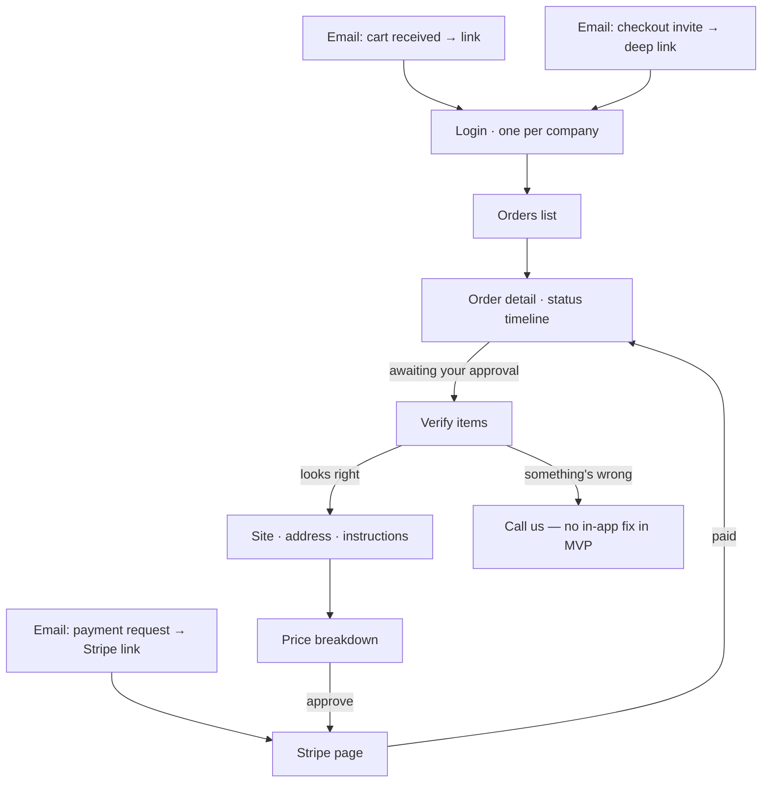

# Company Portal — Wireframes (scratch)

> **Status:** Brainstorm output, not yet promoted to `docs/`. Mobile frame: 390×844.
> Companion reading: [order lifecycle](../docs/architecture/04-order-lifecycle.md) · [customer guide](../docs/runbooks/customer-guide.md).

## Screen flow



## Decisions taken in these wireframes

1. **Wizard = one page, 3 sections, sticky approve button.** One-shot flow; mobile back-navigation shouldn't strand anyone mid-wizard. Three separate screens buys nothing here.
2. **"Start order" is a card pinned to the top of the Orders list**, not a tab. Every email link lands on this screen, so the alias is always one screen away. "Email me the address" is the mobile workaround — it puts the address in their inbox, which is reachable from inside Home Depot's share dialog.
3. **Order detail's primary CTA is status-driven** (table at the bottom). It is the only screen every order visits, including the dispatcher-completes-on-behalf path that never sees the wizard.
4. **Item thumbnails: yes.** The cart email carries `image_url` per line item; it is the cheapest way to make "did we read your cart right?" glanceable.
5. **Saved job sites: wire the Site dropdown now** — a Phase 4 item, but the wizard's Site field needs it from the start.
6. **"Save as contact" cut.** Home Depot has no contact picker, and OS/browser email autofill is unreliable. Copy + "email me the address" are the paths that actually work.

## 1. Orders list

```
┌──────────────────────────────────────────────────────┐
│  Acme Construction                          [ user ] │
├──────────────────────────────────────────────────────┤
│  ┌────────────────────────────────────────────────┐  │
│  │  Start an order                                │  │
│  │                                                │  │
│  │  Build your cart at Home Depot or Lowe's,      │  │
│  │  then share it to:                             │  │
│  │                                                │  │
│  │  ┌──────────────────────────────────────────┐  │  │
│  │  │ acme@orders.example.com            [ ⧉ ] │  │  │
│  │  └──────────────────────────────────────────┘  │  │
│  │                                                │  │
│  │  Don't check out — the cart is your request.   │  │
│  │  How to share →                                │  │
│  └────────────────────────────────────────────────┘  │
├──────────────────────────────────────────────────────┤
│  Your orders                                         │
│                                                      │
│  #1042   Delivered            $482.80   →            │
│          Home Depot · Sep 17                         │
│  ────────────────────────────────────────────────    │
│  #1039   Awaiting approval    $120.10   →            │
│          Lowe's · Sep 16                             │
└──────────────────────────────────────────────────────┘
```

Empty state: the Start order card, plus "No orders yet — send your first cart."

## 2. Start an order (from the card's "How to share →")

```
┌──────────────────────────────────────────────────────┐
│  ←  Start an order                                   │
├──────────────────────────────────────────────────────┤
│  1 · Build your cart                                 │
│      At homedepot.com or lowes.com.                  │
│      Set the store you'd actually go to.             │
│                                                      │
│  2 · Share it to this address                        │
│      ┌──────────────────────────────────────────┐    │
│      │ acme@orders.example.com            [ ⧉ ] │    │
│      └──────────────────────────────────────────┘    │
│      Tap copy, then paste it into the share form.    │
│                                                      │
│  3 · We email you to confirm                         │
│      Check the items and the price, then approve.    │
│      Nothing is ordered until you approve.           │
│                                                      │
├──────────────────────────────────────────────────────┤
│  [  Copy address  ]  [  Email me the address  ]      │
└──────────────────────────────────────────────────────┘
```

## 3. Order detail (the home screen)

```
┌──────────────────────────────────────────────────────┐
│  ←  Orders                                           │
├──────────────────────────────────────────────────────┤
│  Order #1042                                         │
│  Home Depot · 4 items                                │
│                                                      │
│  ◉ Delivered                                         │
├──────────────────────────────────────────────────────┤
│  Progress                                            │
│    ✓ Received              Sep 16 · 8:02a            │
│    ✓ You approved          Sep 16 · 8:40a            │
│    ✓ Driver assigned       Sep 16 · 9:15a            │
│    ✓ At store              Sep 16 · 10:10a           │
│    ✓ Purchased             Sep 16 · 10:44a           │
│    ✓ On the way            Sep 16 · 11:02a           │
│    ◉ Delivered             Sep 16 · 11:47a           │
│    ○ Payment due                                     │
├──────────────────────────────────────────────────────┤
│  Delivery                                            │
│    421 Commerce Rd, Bldg 3                           │
│    Gate code 4412 · ask for Dave                     │
├──────────────────────────────────────────────────────┤
│  Items (4)                                $412.80    │
│    [▣] Deck screws                1×      $216.60    │
│    [▣] 2×4×8 lumber              12×      $196.20    │
│    Show all →                                        │
├──────────────────────────────────────────────────────┤
│  Price                                               │
│    Materials                              $412.80    │
│    Sizing fee                              $25.00    │
│    Delivery fee                            $45.00    │
│    Total                                  $482.80    │
├──────────────────────────────────────────────────────┤
│  [            Pay $482.80             ]   ← sticky   │
└──────────────────────────────────────────────────────┘
```

Delivered adds the delivery photo and receipt above the CTA. `needs_review` looks the same minus the CTA — the customer just sees "Received · we're reviewing your cart."

## 4. Checkout wizard (one page, three sections)

```
┌──────────────────────────────────────────────────────┐
│  ←  Order #1042                                      │
│     Review & approve                                 │
├──────────────────────────────────────────────────────┤
│  1 · Check the items                                 │
│      We read these from your shared cart:            │
│      ┌──────────────────────────────────────────┐    │
│      │ [▣] Deck screws      1×         $216.60  │    │
│      │ [▣] 2×4×8 lumber    12×         $196.20  │    │
│      └──────────────────────────────────────────┘    │
│      Wrong? Call us — we'll fix it before anything   │
│      is ordered.                                     │
├──────────────────────────────────────────────────────┤
│  2 · Delivery                                        │
│      Site     [ 421 Commerce Rd            ▾ ]       │
│      Notes    [ Gate code 4412, rear entr…   ]       │
│      Contact  [ Dave            ] [ 864-555-0147 ]   │
├──────────────────────────────────────────────────────┤
│  3 · Price                                           │
│      Materials                            $412.80    │
│      Sizing fee                            $25.00    │
│      Delivery fee                          $45.00    │
│      Total                                $482.80    │
├──────────────────────────────────────────────────────┤
│  [        Approve · $482.80           ]  ← sticky    │
│  You pay after delivery. Nothing is ordered until    │
│  you approve.                                        │
└──────────────────────────────────────────────────────┘
```

## Order detail CTA by status

| Order status            | Primary CTA                                      |
| ----------------------- | ------------------------------------------------ |
| Received / needs review | none — "We're reviewing your cart"               |
| Awaiting your approval  | **Review & approve** → wizard                    |
| Confirmed → On the way  | none — timeline only                             |
| Delivered               | **Pay $482.80** → Stripe (photo + receipt above) |
| Payment requested       | **Pay $482.80** → Stripe                         |
| Paid / closed           | none                                             |

## Open questions

- Exact alias domain (placeholder `orders.example.com` throughout).
- "Start an order": card-only vs its own screen — decide when we see a real mockup.
