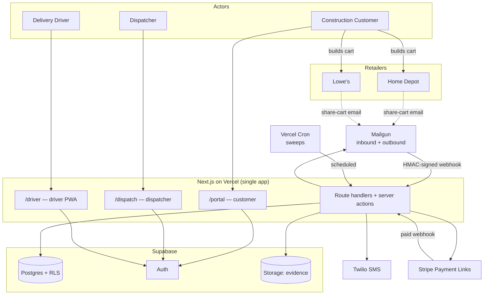
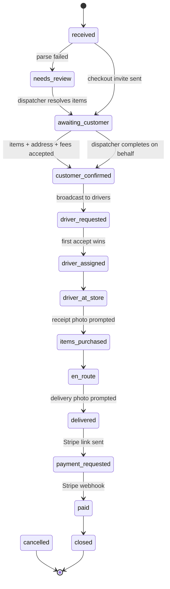
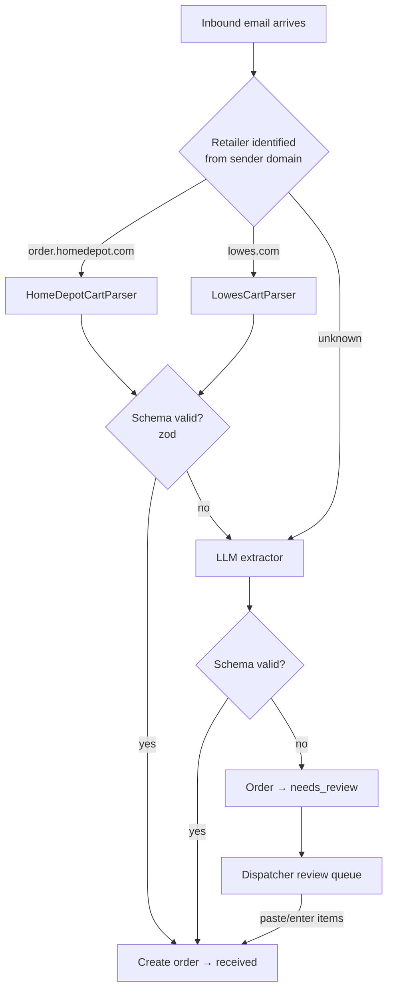
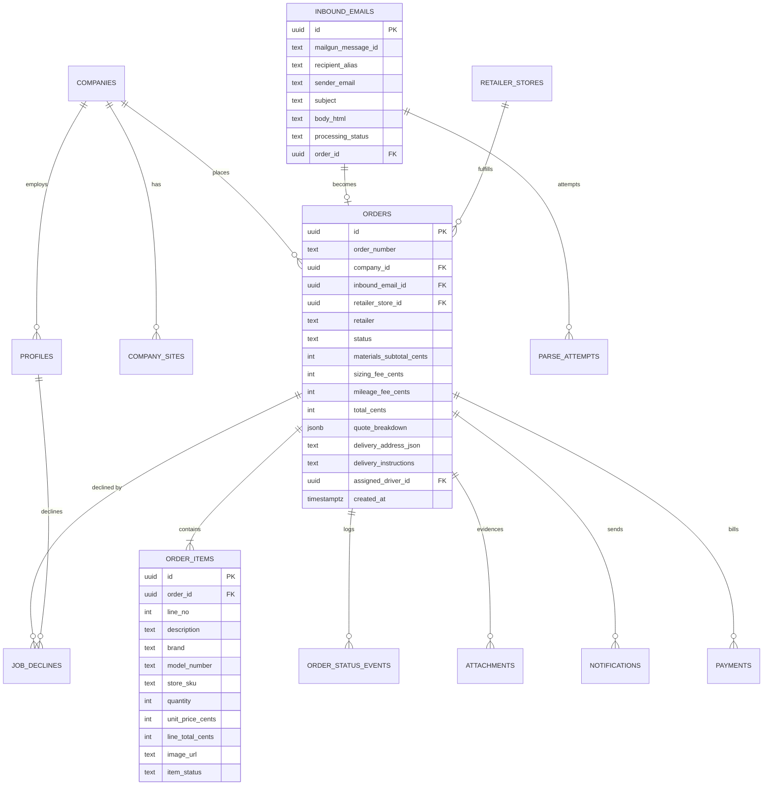

# Delivery App MVP — Systems Architecture & Delivery Plan

Establish the full system architecture, data model, and phased build plan for a construction-site delivery MVP — starting with a repo-committed set of Markdown + Mermaid design documents.

> **Status:** Approved architecture. Phase 0 (design artifacts) complete.
> **Owner:** Delivery App team · **Last updated:** 2026-09-16

---

## Summary

Build the systems needed for a construction-site delivery MVP: a Next.js app (three role-guarded UIs) on Supabase, with a Mailgun-driven email-cart intake that parses Home Depot / Lowe's share-cart emails into structured orders, a dispatcher console that drives the order through a guarded state machine, a driver job board with first-accept-wins dispatch, and Stripe Payment Links for collection.

This document is the entry point and roadmap. Phases 1–7 below are the implementation sequence; the numbered documents in this directory expand each subsystem.

---

## Source material reviewed

| Document                                                        | What it established                                                               |
| --------------------------------------------------------------- | --------------------------------------------------------------------------------- |
| `External Notes/Low Tech Flow.pdf` (23pp)                       | Full manual runbook, 10 status names, 3 persona guides, email template, fee model |
| `External Notes/Delivery App Workflow.pdf` (4pp)                | Persona step lists, vNext ideas, 14 open questions                                |
| `External Notes/MVP for Delivery App.pdf` (1p)                  | Four intake options, checkout requirements, deferred concepts                     |
| `External Notes/Share Cart Invitation From Anthony Palumbi.eml` | Analyzed field-by-field — see [Findings](#findings-from-the-example-email)        |

---

## Findings from the example email

These five findings were derived by inspecting the real Home Depot share-cart email and drove several locked decisions. They are recorded here because they are the empirical basis for the parser design and the store-capture decision.

| Finding                               | Evidence                                                                                                                                    | Consequence                                                                    |
| ------------------------------------- | ------------------------------------------------------------------------------------------------------------------------------------------- | ------------------------------------------------------------------------------ |
| Full line items are in the email body | `Model #9988872`, `Store SKU #1014148280`, `Aisle`/`Bay` columns, qty `1`, `$216.60`, image URL `…/deckmate-deck-screws-9988872-64_400.jpg` | No scraping needed for items. Parsing is a solved, deterministic problem.      |
| **No store identifier anywhere**      | 0 matches for store name/number/zip across 136KB of HTML. `pickup-store` is an empty CSS wrapper class, not data.                           | Confirms dispatcher-sets-store is required, not a shortcut.                    |
| Shared cart page is bot-blocked       | `curl` on the supplied `sharedCartId` URL → **HTTP 403** (Akamai Bot Manager)                                                               | Fetching the cart link is not a cheap MVP path. Rules out store-scraping.      |
| Items appear twice                    | `desktop_item_list` (visible) and `mobile_item_list` (`display:none`) both contain the cart                                                 | Parser must scope to `desktop_item_list` or dedupe, or every order doubles.    |
| HTML-only, no plain-text part         | Single `text/html` MIME part, `quoted-printable`                                                                                            | Parser operates on HTML; Mailgun's `body-plain` is auto-synthesized and lossy. |

---

## Locked decisions

| Area            | Decision                                                                                  |
| --------------- | ----------------------------------------------------------------------------------------- |
| Persistence     | Supabase (Postgres + Auth + Storage + RLS)                                                |
| Front end       | Next.js App Router, **one app, 3 route groups**: `/dispatch`, `/driver`, `/portal`        |
| Hosting         | Vercel                                                                                    |
| Email in + out  | **Mailgun** inbound routes → webhook; Mailgun for outbound                                |
| SMS             | Twilio                                                                                    |
| Payments        | Stripe Payment Links + webhook                                                            |
| Background jobs | **Vercel Cron sweeps** over a notifications outbox + broadcast expiry. No workflow engine |
| Intake paths    | Per-company email alias **and** post-intake portal checkout                               |
| Order identity  | **Per-company alias only**; unmatched alias → review queue                                |
| Company model   | Company = org, **one portal login** per company                                           |
| Auth            | Email-as-username + password (Supabase Auth)                                              |
| Store capture   | **Dispatcher sets it manually** from a seeded store table                                 |
| Parsing         | Deterministic parser → schema validation → LLM fallback → dispatcher review queue         |
| Item metadata   | Email fields only. No enrichment API, no scraping.                                        |
| Quote           | **Manual fee entry** by dispatcher                                                        |
| Driver comms    | In-app job board + SMS notify; first-accept-wins                                          |
| Customer UX     | Simplified portal: login, history, order detail/status, checkout                          |
| Photo gates     | **Prompt but never block**; skip requires a reason                                        |
| Parallel run    | **None.** No Slack, no Google Sheets. App is the sole system of record.                   |
| Market          | Greenville/Spartanburg, SC → Supabase `us-east-1`                                         |
| Docs            | Markdown + Mermaid, committed in-repo                                                     |

Each decision has a corresponding ADR in [`docs/adr/`](../adr/README.md).

---

## MVP scope

### In scope

- Email alias intake → deterministic cart parse → order created
- Dispatcher console: review queue, order board, item verification/edit, store assignment, fee entry, status transitions, complete-checkout-on-behalf, payment link send
- Customer portal: login, order list + history, order detail with status timeline, checkout wizard (verify items → address + instructions → fees → accept → pay)
- Driver app (mobile-first): job board, accept, status advance, photo upload (skippable with reason)
- SMS/email notifications for checkout invite, job broadcast, payment request
- Stripe Payment Links + paid-state webhook
- Admin: companies + aliases + portal users, store seeding, driver management

### Explicitly deferred

Designed for, not built. Each item's extension hook is documented in [12-deferred-and-extension-points.md](12-deferred-and-extension-points.md).

Item substitution · cancellation UI · automated customer status fan-out · multi-store orders · parts catalog / concierge procurement · smart iFrame · chat experience · aisle/bay data · product enrichment API · native mobile apps · driver payouts (Stripe Connect) · fee rule engine · Slack integration

---

## Target architecture



### Order lifecycle (guarded state machine)



`cancelled` exists in the enum and the transition map from day one, but has no UI in the MVP — that is what makes cancellation a small later addition rather than a refactor.

### Parsing fallback ladder



Every attempt — deterministic or LLM — is recorded in `parse_attempts` with parser version, output, and errors, so template drift is visible rather than silent.

---

## Data model



Full table list (Phase 1 migrations): `companies`, `profiles`, `company_sites`, `retailer_stores`, `inbound_emails`, `parse_attempts`, `orders`, `order_items`, `order_status_events`, `job_declines`, `attachments`, `notifications`, `payments`, plus enums for `user_role`, `order_status`, `retailer`, `item_status`, `notification_status`, `payment_status`.

Two design choices that protect the deferred features:

- **`order_status_events` is an append-only event log.** Automated customer status emails become a fan-out on this table — no schema change.
- **`quote_breakdown` is jsonb** alongside the scalar fee columns. Adding a fee rule engine later doesn't reshape the order table.

---

## Documentation structure

All 27 documents below are written. See [docs/README.md](../README.md) for the index.

```
docs/
  README.md                              # index + reading order
  architecture/
    00-overview.md                       # this document
    01-system-context.md                 # C4 L1
    02-containers.md                     # C4 L2
    03-data-model.md                     # ERD + table-by-table reference
    04-order-lifecycle.md                # state machine + transition/permission table
    05-email-intake.md                   # Mailgun route, alias scheme, webhook contract
    06-cart-parsing.md                   # parser design, HD field map, fallback ladder
    07-dispatch.md                       # postings, declines, first-accept-wins
    08-notifications.md                  # templates + trigger matrix
    09-payments.md                       # Stripe links + webhook
    10-auth-and-permissions.md           # roles, RLS, route guards
    11-deployment-and-environments.md
    12-deferred-and-extension-points.md  # each deferred item + its hook
  adr/
    0001-supabase-postgres.md
    0002-single-nextjs-app-three-route-groups.md
    0003-mailgun-for-inbound-cart-email.md
    0004-deterministic-parser-with-llm-fallback.md
    0005-inngest-durable-workflows.md
    0006-stripe-payment-links.md
    0007-email-password-auth.md
    0008-dispatcher-assigns-store.md
    0009-inline-intake-and-cron-sweeps.md
  runbooks/
    customer-guide.md
    dispatcher-guide.md
    driver-guide.md
    dry-run-checklist.md
```

---

## Implementation roadmap

### Phase 0 — Design artifacts ✅ complete

1. ✅ Created the `docs/` tree above.
2. ✅ Wrote `00-overview.md`: locked decisions table, MVP in/out scope, the source findings.
3. ✅ Wrote the 12 architecture docs with embedded Mermaid diagrams (context, containers, ERD, state machine, intake sequence, dispatch sequence, delivery + payment sequence, parsing ladder, deployment).
4. ✅ Wrote 8 ADRs — each with context / decision / consequences / alternatives rejected.
5. ✅ Rewrote the three persona runbooks against the _new_ system (the PDFs describe the retired low-tech process).
6. ✅ Wrote `12-deferred-and-extension-points.md`, mapping every deferred item to the specific hook that makes it cheap later, plus a full source-material traceability table.
7. ➖ **Skipped:** SVG exports. Every diagram renders correctly on GitHub, so there was nothing to work around.

**Verified:** 16/16 Mermaid diagrams parse; 104 file links and 11 anchor links resolve. See the [verification checklist](#verification-checklist).

### Phase 1 — Foundation

Domain purchase + DNS/MX for Mailgun · Supabase project (`us-east-1`) · Vercel project · repo scaffold (Next.js, TS, Tailwind, shadcn/ui) · all migrations + RLS + enums · seed `retailer_stores` for Upstate SC · auth + role claims + three guarded route groups · CI (lint, typecheck, test).

### Phase 2 — Email intake + parsing _(highest risk — deliberately early)_

Mailgun route `match_recipient("(?P<alias>[^@]+)@orders.<domain>")` → `forward()` + `store(notify=…)` · webhook with HMAC verification, idempotency on message ID, inline parse · `inbound_emails` persistence · `HomeDepotCartParser` with golden-file tests built from the provided `.eml` · validation + LLM fallback + review queue.

### Phase 3 — Dispatcher console

Review queue · order board with aging indicators · order detail (verify/edit items, assign store, enter fees, advance status, complete-on-behalf) · admin for companies, aliases, portal users, stores, drivers.

### Phase 4 — Customer portal + checkout

Login · order list + history · order detail with status timeline · checkout wizard · saved job sites · checkout-invite email.

### Phase 5 — Dispatch + driver app

Job board (all open postings) · atomic first-accept-wins through the transition choke point · Twilio broadcast · mobile-first driver UI · status advance · photo upload with skip-reason.

### Phase 6 — Payments

Stripe Payment Link creation · send on `delivered` · `checkout.session.completed` webhook → `paid` · receipt email.

### Phase 7 — Hardening

Structured logging + error tracking · system-health panel · RLS test suite · concurrency test on the accept race · runbooks.

---

## Verification checklist

Phase 0 self-verification, with the evidence for each item.

- [x] **Every Mermaid block parses.** 16 diagrams across 9 files validated against the `mermaid` parser — not eyeballed. All 16 pass.
- [x] **All documentation links resolve.** 104 file links and 11 anchor links verified programmatically. No dead links.
- [x] **ADR coverage.** 9 ADRs cover the decisions with real trade-offs — persistence, app structure, email vendor, parsing strategy, background work, payments, auth, and store assignment. The remaining locked decisions (fee entry, photo gating, market) are recorded in the decisions table above; they are configuration choices rather than architectural ones and do not warrant a record each.
- [x] **Source traceability.** Every intake option and vNext idea from the source PDFs is mapped to a disposition in [12-deferred-and-extension-points](12-deferred-and-extension-points.md#traceability-source-material-to-disposition).
- [x] **Runbook ↔ state machine consistency.** Dispatcher, driver, and customer guides were checked against the transitions in [04-order-lifecycle](04-order-lifecycle.md). This check caught a real gap: the customer guide's status list omitted `driver_requested` and `payment_requested`, both of which a customer can see. Fixed.
- [x] **Parser field map matches the real email.** Every field in [06-cart-parsing](06-cart-parsing.md#home-depot-field-map) was extracted from the actual `.eml`, including the duplicate-view trap and the empty Aisle/Bay values.
- [ ] **Diagram legibility review.** Rendering correctness is verified; _legibility_ needs a human. Confirm the container diagram, ERD, and state machine read clearly before the team relies on them.
- [x] **Open blockers documented** — see below.

### Gaps this verification did not close

- **Multi-item carts are unverified.** The sample email contains exactly one item, so the parser's row-repetition assumption is inferred, not observed. A multi-item fixture is required before the parser is considered done.
- **The Lowe's format is entirely unknown.** No sample has been seen.

---

## Risks and considerations

| Risk                                                                          | Mitigation                                                                                                       |
| ----------------------------------------------------------------------------- | ---------------------------------------------------------------------------------------------------------------- |
| **No Lowe's sample email** — `LowesCartParser` cannot be specified accurately | LLM fallback covers Lowe's on day one; capture a real Lowe's email before Phase 2 completes                      |
| **No domain owned yet** — blocks Mailgun inbound entirely                     | Explicit Phase 1 prerequisite; this document uses `orders.example.com` placeholders                              |
| Home Depot template drift silently breaks parsing                             | Golden-file tests + versioned parser + `parse_attempts` telemetry + review queue as backstop                     |
| Mailgun `forward()` retries if the webhook is slow                            | Persist the email before parsing, re-process duplicates that are still pending, and keep the parser fast         |
| Job-accept race (two drivers accept simultaneously)                           | Enforced by the row-locking state transition on the order, never in app code                                     |
| PII exposure (addresses, phones, receipt photos)                              | RLS on every table, private storage bucket, signed URLs only                                                     |
| Three UIs in one app risks a muddled boundary                                 | Route groups + role guards from commit one; the ADR records when to split                                        |
| "Prompt but never block" photos weakens the dispute evidence trail            | Every skip records a reason and is visible on the order detail and to the dispatcher                             |
| Portal is load-bearing with no email fallback for address/acceptance          | Dispatcher can complete checkout on the customer's behalf; treat portal availability as critical during dry runs |

---

## Open blockers

To resolve before Phase 2:

1. **A real Lowe's share-cart email** — required to specify the second parser.
2. **Domain name** — required for Mailgun inbound routes and MX records.
3. **Stripe, Twilio, and Mailgun accounts** — Supabase and Vercel already exist.
4. **Upstate SC store list** — confirm the radius and which Lowe's / Home Depot locations to seed.
