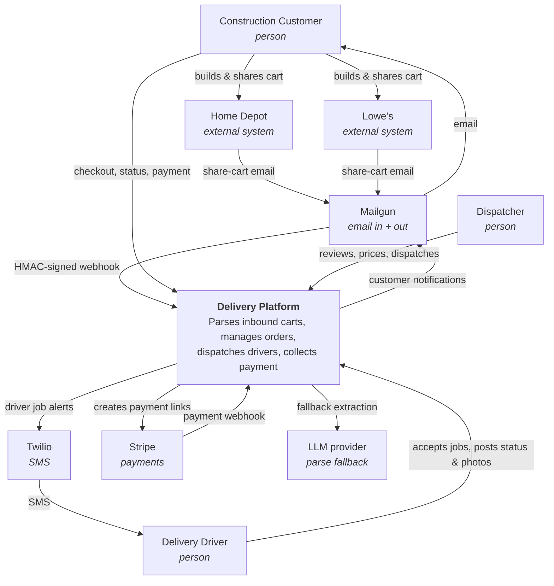

# 01 — System Context (C4 Level 1)

Who uses the system, what it depends on, and what crosses the boundary.

> **Status:** Planned design. Not yet implemented. See [00-overview](00-overview.md) for locked decisions and roadmap.

---

## Purpose

This is the outermost view: the people and external services the delivery platform interacts with, and the data that crosses the boundary. It deliberately says nothing about internal structure — that is [02-containers](02-containers.md).

---

## Actors

| Actor | Goal | Interacts with |
|---|---|---|
| **Construction Customer** | Get materials to a job site without leaving to buy them | Home Depot / Lowe's websites (to build a cart), our inbound email alias, the customer portal |
| **Dispatcher** | Turn an inbound cart into a completed, paid delivery | Dispatcher console; phone/email as fallback for exceptions |
| **Delivery Driver** | Accept jobs, buy materials, deliver, get paid | Driver web app (mobile-first) |

A fourth role — **Admin** — exists in the permission model but is not a separate person in the MVP. Dispatchers hold admin permissions (managing companies, stores, and drivers).

---

## External systems

| System                 | Role                                                         | Direction | Data crossing                                                            |
|----------------------|------------------------------------------------------------|---------|------------------------------------------------------------------------|
| **Home Depot website** | Where the customer builds and shares the cart                | Out only  | None — we never call Home Depot                                          |
| **Lowe's website**     | Same                                                         | Out only  | None                                                                     |
| **Mailgun**            | Receives inbound cart emails; sends outbound customer email  | In + Out  | Inbound: raw MIME cart email. Outbound: transactional email to customers |
| **Twilio**             | SMS notifications to drivers                                 | Out       | Driver phone number, short job summary                                   |
| **Stripe**             | Collects payment                                             | Out + In  | Out: order total, description. In: `checkout.session.completed` webhook  |
| **LLM provider**       | Fallback cart extraction when the deterministic parser fails | Out       | Outbound: sanitized email HTML. Inbound: structured JSON                 |
| **Supabase**           | Postgres, Auth, file storage                                 | Out       | All application data                                                     |
| **Vercel**             | Hosting                                                      | —         | —                                                                        |

### A note on the retailers

We integrate with Home Depot and Lowe's **only through the customer's own use of their "share cart" feature**. There is no API integration, no scraping, and no bot-bypass infrastructure in the MVP.

This is a deliberate architectural boundary, and it is load-bearing:

- The share-cart **email** is our integration point — a stable, documented artifact that the retailers generate on the customer's behalf.
- The share-cart **web page** is *not* an integration point. It returned HTTP 403 to a plain fetch (Akamai Bot Manager), and pursuing it would mean residential proxies and a permanent maintenance burden.
- Consequently, the **store location is not machine-readable** and is set by the dispatcher. See [ADR-0008](../adr/0008-dispatcher-assigns-store.md).

---

## System context diagram

---

## Trust boundaries

| Boundary | Consideration |
|---|---|
| **Inbound email → platform** | Anyone can send mail to our alias. Webhook authenticity is established by Mailgun's HMAC signature; sender authenticity by the retailer's DKIM. See [05-email-intake](05-email-intake.md). |
| **LLM provider** | Receives sanitized email HTML. Must not receive customer PII beyond what the retailer already put in the cart email. |
| **Customer portal → data** | Authenticated per company. Row Level Security is the enforcement point, not application code. See [10-auth-and-permissions](10-auth-and-permissions.md). |
| **Driver app → data** | A driver must never see another driver's jobs, nor any customer data before accepting. |
| **Stripe** | No card data ever reaches our servers. We store only Stripe identifiers and amounts. |
| **Storage** | Receipt and delivery photos are private. Access is via short-lived signed URLs only. |

---

## What is deliberately outside the system

- Product catalog, search, or pricing feeds
- Real-time retailer inventory checks
- Retailer APIs or scraping
- Driver payroll and payouts
- Native mobile applications

Each is tracked with its extension hook in [12-deferred-and-extension-points](12-deferred-and-extension-points.md).
