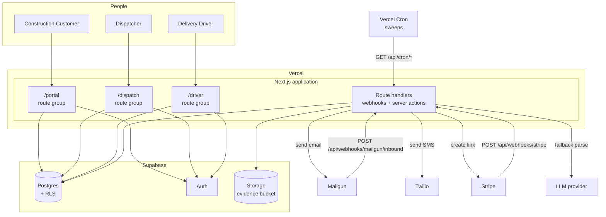

# 02 — Containers (C4 Level 2)

The deployable units, what runs where, and how they communicate.

> **Status:** Planned design. Not yet implemented. See [00-overview](00-overview.md).

---

## Containers

| Container           | Technology                               | Responsibility                                                                               |
| ------------------- | ---------------------------------------- | -------------------------------------------------------------------------------------------- |
| **Web application** | Next.js (App Router), deployed to Vercel | All three personas' UIs, plus route handlers for webhooks and server actions                 |
| **Database**        | Supabase Postgres                        | System of record. Enforces the state machine's uniqueness constraints and Row Level Security |
| **Auth**            | Supabase Auth                            | Email + password identity for all three roles                                                |
| **Object storage**  | Supabase Storage                         | Receipt and delivery photos. Private bucket, signed URLs                                     |
| **Scheduled jobs**  | Vercel Cron                              | Timed sweeps: the notifications outbox and broadcast expiry                                  |
| **Inbound email**   | Mailgun Routes                           | Receives cart emails, verifies DKIM, POSTs to our webhook                                    |
| **Outbound email**  | Mailgun                                  | Transactional email to customers                                                             |
| **SMS**             | Twilio                                   | Driver job alerts                                                                            |
| **Payments**        | Stripe Payment Links                     | Collection, with a webhook back into the app                                                 |

There is exactly **one application container**. The three personas are route groups inside it, not separate deployments. See [ADR-0002](../adr/0002-single-nextjs-app-three-route-groups.md).

---

## Container diagram



---

## What runs inline, and what runs on a schedule

Most work is fast enough to run in the request that triggered it:

| Work                                        | Where it runs                                                                                                                                               |
| ------------------------------------------- | ----------------------------------------------------------------------------------------------------------------------------------------------------------- |
| Parsing an inbound cart                     | **Inline.** The deterministic parser is sub-second; a failure is recorded and lands in the review queue, so nothing is lost by responding after the attempt |
| Sending a notification                      | **Outbox.** The row is written with the state change, attempted immediately, and retried by a cron sweep                                                    |
| Broadcast expiry                            | **Cron sweep.** A timer per open posting is just a query for orders older than the TTL                                                                      |
| Waiting for a customer to complete checkout | **Nothing to run.** The state lives in the database until the customer acts                                                                                 |

So the pattern is: **handlers validate, persist, act, and respond; anything that can fail independently becomes an outbox row a sweep will retry.** There is no workflow engine in the MVP — see [ADR-0009](../adr/0009-inline-intake-and-cron-sweeps.md).

---

## Application module layout

```text
src/
  app/
    (dispatch)/                 # dispatcher console — role: dispatcher
      orders/
      review-queue/
      companies/
      stores/
      drivers/
    (driver)/                   # driver app — role: driver
      jobs/
      active/
    (portal)/                   # customer portal — role: customer
      orders/
      checkout/
      sites/
    api/
      webhooks/
        mailgun/inbound/route.ts
        stripe/route.ts
      cron/
        drain-notifications/route.ts
        expire-broadcasts/route.ts
    login/
  lib/
    parsers/
      index.ts                  # retailer detection + orchestration
      schema.ts                 # zod schemas — shared by all strategies
      homedepot.ts
      lowes.ts
      llm-fallback.ts
      extract.ts                # HTML helpers
    orders/
      state-machine.ts          # transition map (single source of truth)
      transition.ts             # transitionOrder() — the only writer of orders.status
      numbering.ts
      quote.ts
    auth/
      session.ts
      guards.ts                 # requireRole()
    notifications/
      templates/
      send.ts
      outbox.ts                 # enqueue + drain
    payments/
      stripe.ts
    supabase/
      client.ts                 # browser client
      server.ts                 # RLS-scoped server client
      admin.ts                  # service role — webhooks + cron only
```

Two rules this layout encodes:

1. **`lib/orders/transition.ts` is the only code that writes `orders.status`.** Every status change goes through it, so guards, audit events, and side effects cannot be bypassed. See [04-order-lifecycle](04-order-lifecycle.md).
2. **`lib/parsers/schema.ts` is imported by every strategy** — deterministic, LLM, and manual entry all produce the same validated shape.

---

## Communication patterns

| From → To                 | Pattern                                 | Notes                                                |
| ------------------------- | --------------------------------------- | ---------------------------------------------------- |
| Browser → Next.js         | HTTPS, server actions + RSC             | Session cookie from Supabase Auth                    |
| Next.js → Postgres        | `supabase-js` with the user's JWT       | RLS applies                                          |
| Route handlers → Postgres | `supabase-js` with the **service role** | Bypasses RLS by design; webhooks are not user-scoped |
| Mailgun → Next.js         | `POST` form-encoded, HMAC-signed        | Processed inline; must respond within Mailgun's timeout |
| Stripe → Next.js          | `POST` JSON, signature-verified         | Must ACK fast                                        |
| Next.js → Twilio          | REST                                    | Called inline, or from a cron sweep                  |
| Vercel Cron → Next.js     | GET `/api/cron/*`                       | Shared-secret header; drains the outbox and expires broadcasts |

---

## Environments

Three environments, described in detail in [11-deployment-and-environments](11-deployment-and-environments.md):

| Environment       | App               | Database                      | Email                          | Payments    |
| ----------------- | ----------------- | ----------------------------- | ------------------------------ | ----------- |
| Local             | `next dev`        | Supabase CLI (local Postgres) | Mailgun sandbox                | Stripe test |
| Preview / staging | Vercel preview    | Staging Supabase project      | **Separate Mailgun subdomain** | Stripe test |
| Production        | Vercel production | Production Supabase project   | Production subdomain           | Stripe live |

The separate staging email subdomain is not a nicety — Mailgun routes are per-domain, so sharing a domain across environments would deliver every inbound cart email to both environments.
