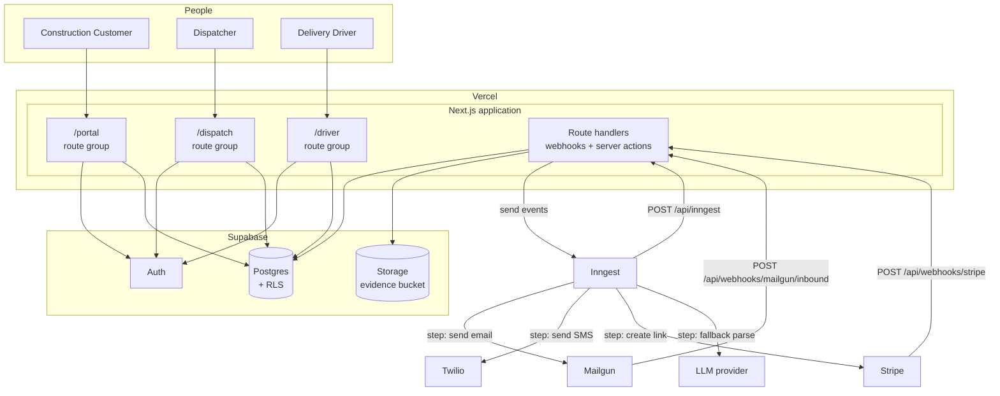

# 02 — Containers (C4 Level 2)

The deployable units, what runs where, and how they communicate.

> **Status:** Planned design. Not yet implemented. See [00-overview](00-overview.md).

---

## Containers

| Container | Technology | Responsibility |
|---|---|---|
| **Web application** | Next.js (App Router), deployed to Vercel | All three personas' UIs, plus route handlers for webhooks and server actions |
| **Database** | Supabase Postgres | System of record. Enforces the state machine's uniqueness constraints and Row Level Security |
| **Auth** | Supabase Auth | Email + password identity for all three roles |
| **Object storage** | Supabase Storage | Receipt and delivery photos. Private bucket, signed URLs |
| **Workflow engine** | Inngest | Durable multi-step work: parsing, notifications, offer expiry, payment follow-up |
| **Inbound email** | Mailgun Routes | Receives cart emails, verifies DKIM, POSTs to our webhook |
| **Outbound email** | Mailgun | Transactional email to customers |
| **SMS** | Twilio | Driver job alerts |
| **Payments** | Stripe Payment Links | Collection, with a webhook back into the app |

There is exactly **one application container**. The three personas are route groups inside it, not separate deployments. See [ADR-0002](../adr/0002-single-nextjs-app-three-route-groups.md).

---

## Container diagram



---

## Why the workflow engine sits in the middle

Several steps in this domain are **long-running, must survive failures, and cannot block a request**:

| Work | Why it can't be inline |
|---|---|
| Parsing an inbound cart | Mailgun retries if the webhook is slow. Parsing (especially the LLM fallback) can take seconds to tens of seconds. |
| Waiting for a customer to complete checkout | Hours or days. Cannot hold a connection. |
| Offer expiry | Needs a timer per offer. |
| Retry on transient provider failure | Twilio and Stripe both fail transiently; each step needs independent retry. |

So the pattern is uniform: **route handlers validate, persist, enqueue, and return 200 fast.** Everything else happens as a durable workflow step. See [ADR-0005](../adr/0005-inngest-durable-workflows.md).

---

## Application module layout

```text
src/
  app/
    (dispatch)/                 # dispatcher console — role: dispatcher
      orders/
      review-queue/
      companies/
      stores/
      drivers/
    (driver)/                   # driver app — role: driver
      jobs/
      active/
    (portal)/                   # customer portal — role: customer
      orders/
      checkout/
      sites/
    api/
      webhooks/
        mailgun/inbound/route.ts
        stripe/route.ts
      inngest/route.ts
    login/
  lib/
    parsers/
      index.ts                  # retailer detection + orchestration
      schema.ts                 # zod schemas — shared by all strategies
      homedepot.ts
      lowes.ts
      llm-fallback.ts
      extract.ts                # HTML helpers
    orders/
      state-machine.ts          # transition map (single source of truth)
      transition.ts             # transitionOrder() — the only writer of orders.status
      numbering.ts
      quote.ts
    auth/
      session.ts
      guards.ts                 # requireRole()
    notifications/
      templates/
      send.ts
    payments/
      stripe.ts
    supabase/
      client.ts                 # browser client
      server.ts                 # RLS-scoped server client
      admin.ts                  # service role — webhooks only
  inngest/
    client.ts
    functions/
      process-inbound-email.ts
      send-checkout-invite.ts
      broadcast-job-offer.ts
      expire-job-offer.ts
      request-payment.ts
```

Two rules this layout encodes:

1. **`lib/orders/transition.ts` is the only code that writes `orders.status`.** Every status change goes through it, so guards, audit events, and side effects cannot be bypassed. See [04-order-lifecycle](04-order-lifecycle.md).
2. **`lib/parsers/schema.ts` is imported by every strategy** — deterministic, LLM, and manual entry all produce the same validated shape.

---

## Communication patterns

| From → To | Pattern | Notes |
|---|---|---|
| Browser → Next.js | HTTPS, server actions + RSC | Session cookie from Supabase Auth |
| Next.js → Postgres | `supabase-js` with the user's JWT | RLS applies |
| Route handlers → Postgres | `supabase-js` with the **service role** | Bypasses RLS by design; webhooks are not user-scoped |
| Next.js → Inngest | Event send (`inngest.send`) | Fire-and-forget from the request path |
| Inngest → Next.js | Step callbacks to `/api/inngest` | Steps call back into our own functions |
| Mailgun → Next.js | `POST` form-encoded, HMAC-signed | Must ACK fast |
| Stripe → Next.js | `POST` JSON, signature-verified | Must ACK fast |
| Next.js → Twilio | REST | Called from a workflow step |

---

## Environments

Three environments, described in detail in [11-deployment-and-environments](11-deployment-and-environments.md):

| Environment | App | Database | Email | Payments |
|---|---|---|---|---|
| Local | `next dev` + Inngest dev server | Supabase CLI (local Postgres) | Mailgun sandbox | Stripe test |
| Preview / staging | Vercel preview | Staging Supabase project | **Separate Mailgun subdomain** | Stripe test |
| Production | Vercel production | Production Supabase project | Production subdomain | Stripe live |

The separate staging email subdomain is not a nicety — Mailgun routes are per-domain, so sharing a domain across environments would deliver every inbound cart email to both environments.
