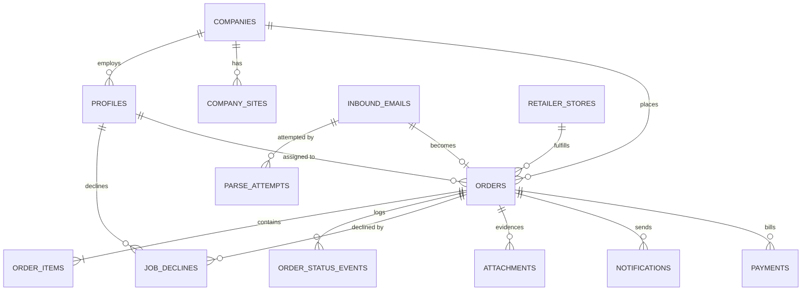

# 03 — Data Model

Schema conventions, the entity relationship diagram, and a table-by-table reference.

> **Status:** Schema written as `supabase/migrations/0001_baseline.sql`. Not yet applied to any environment.

---

## Conventions

| Convention   | Rule                                                                                                      |
| ------------ | --------------------------------------------------------------------------------------------------------- |
| Primary keys | `uuid`, default `gen_random_uuid()`                                                                       |
| Money        | **Integer cents** (`*_cents`), never floats or numeric decimals. `$216.60` → `21660`                      |
| Timestamps   | `timestamptz`, always UTC. `created_at` defaults to `now()`                                               |
| Soft delete  | `active boolean` on reference tables (`companies`, `retailer_stores`, `profiles`). No row is hard-deleted |
| Enums        | Postgres enum types, not free-text columns                                                                |
| Naming       | `snake_case`, plural table names, singular enum type names                                                |
| Addresses    | Stored as discrete columns plus a `jsonb` snapshot on the order                                           |

**Why integer cents:** a delivery total is the sum of a materials subtotal scraped from a retailer email plus fees. Floating point drift in a money field that a customer pays against is not acceptable, and Stripe's API takes integer minor units anyway.

**Why addresses are snapshotted onto the order:** a company may later edit its saved job-site address. The order must preserve what was actually agreed at checkout.

---

## Entity relationship diagram



---

## Enums

| Enum                        | Values                                                                                                                                                                                                                          |
| --------------------------- | ------------------------------------------------------------------------------------------------------------------------------------------------------------------------------------------------------------------------------- |
| `user_role`                 | `dispatcher`, `driver`, `customer`                                                                                                                                                                                              |
| `order_status`              | `received`, `needs_review`, `awaiting_customer`, `customer_confirmed`, `driver_requested`, `driver_assigned`, `driver_at_store`, `items_purchased`, `en_route`, `delivered`, `payment_requested`, `paid`, `closed`, `cancelled` |
| `retailer`                  | `homedepot`, `lowes`                                                                                                                                                                                                            |
| `inbound_processing_status` | `pending`, `parsed`, `needs_review`, `failed`, `ignored`                                                                                                                                                                        |
| `parse_strategy`            | `deterministic`, `llm`, `manual`                                                                                                                                                                                                |
| `item_status`               | `pending`, `purchased`, `unavailable`, `substituted`                                                                                                                                                                            |
| `attachment_kind`           | `receipt`, `delivery`, `item_photo`, `other`                                                                                                                                                                                    |
| `notification_channel`      | `email`, `sms`                                                                                                                                                                                                                  |
| `notification_status`       | `queued`, `sent`, `delivered`, `failed`, `bounced`                                                                                                                                                                              |
| `payment_status`            | `created`, `sent`, `paid`, `expired`, `refunded`                                                                                                                                                                                |

`cancelled` and `substituted` exist from day one with no UI. That is what makes those features additive later. See [12-deferred-and-extension-points](12-deferred-and-extension-points.md).

---

## Table reference

### `companies`

The construction company. Owns the inbound email alias and the portal login.

| Column          | Type                          | Notes                                                                                    |
| --------------- | ----------------------------- | ---------------------------------------------------------------------------------------- |
| `id`            | uuid PK                       |                                                                                          |
| `name`          | text NOT NULL                 |                                                                                          |
| `order_alias`   | citext UNIQUE NOT NULL        | Local part only, e.g. `fixhome`. Combined with the configured domain to form the address |
| `billing_email` | citext                        |                                                                                          |
| `phone`         | text                          |                                                                                          |
| `notes`         | text                          |                                                                                          |
| `active`        | boolean NOT NULL DEFAULT true |                                                                                          |

`order_alias` is `citext` and unique because it is the **sole** order-attribution mechanism. Email local parts are case-insensitive in practice, and a collision would route one company's orders to another.

### `profiles`

One row per authenticated user. Extends `auth.users`.

| Column       | Type                               | Notes                                         |
| ------------ | ---------------------------------- | --------------------------------------------- |
| `id`         | uuid PK                            | References `auth.users(id)` on delete cascade |
| `role`       | user_role NOT NULL                 |                                               |
| `company_id` | uuid FK → companies                | Required when `role = 'customer'`, else null  |
| `full_name`  | text                               |                                               |
| `phone`      | text                               | Driver SMS destination                        |
| `active`     | boolean NOT NULL DEFAULT true      |                                               |
| `created_at` | timestamptz NOT NULL DEFAULT now() |                                               |

**One login per company** in the MVP. The schema permits many profiles per company, so allowing multiple users later is a UI change rather than a migration.

### `company_sites`

Saved job sites, so repeat customers don't re-enter addresses.

| Column                            | Type                           | Notes                                   |
| --------------------------------- | ------------------------------ | --------------------------------------- |
| `id`                              | uuid PK                        |                                         |
| `company_id`                      | uuid FK → companies NOT NULL   |                                         |
| `label`                           | text                           | e.g. "Oakwood Phase 2"                  |
| `address_line1` / `address_line2` | text                           |                                         |
| `city` / `state` / `postal_code`  | text                           |                                         |
| `lat` / `lng`                     | double precision               | Nullable; for future mileage automation |
| `contact_name` / `contact_phone`  | text                           |                                         |
| `instructions`                    | text                           |                                         |
| `is_default`                      | boolean NOT NULL DEFAULT false |                                         |

### `retailer_stores`

Seeded store list. The dispatcher picks from here — this is the only source of store truth, since the cart email carries no store identifier (verified across both Home Depot samples).

| Column                                          | Type                          | Notes                               |
| ----------------------------------------------- | ----------------------------- | ----------------------------------- |
| `id`                                            | uuid PK                       |                                     |
| `retailer`                                      | retailer NOT NULL             |                                     |
| `store_number`                                  | text NOT NULL                 |                                     |
| `name`                                          | text NOT NULL                 | e.g. "North Frisco"                 |
| `address_line1`, `city`, `state`, `postal_code` | text                          |                                     |
| `lat` / `lng`                                   | double precision              |                                     |
| `phone`                                         | text                          |                                     |
| `hours`                                         | jsonb                         |                                     |
| `active`                                        | boolean NOT NULL DEFAULT true |                                     |
|                                                 |                               | UNIQUE (`retailer`, `store_number`) |

### `inbound_emails`

Every message that reaches the inbound webhook, stored before any interpretation.

| Column               | Type                                                 | Notes                                                  |
| -------------------- | ---------------------------------------------------- | ------------------------------------------------------ |
| `id`                 | uuid PK                                              |                                                        |
| `mailgun_message_id` | text UNIQUE                                          | **Idempotency key**                                    |
| `message_id_header`  | text                                                 | Original `Message-ID`                                  |
| `recipient`          | text NOT NULL                                        | Full SMTP recipient                                    |
| `recipient_alias`    | citext                                               | Local part, matched against `companies.order_alias`    |
| `sender_email`       | text NOT NULL                                        | Retailer address, e.g. `HomeDepot@order.homedepot.com` |
| `sender_name`        | text                                                 |                                                        |
| `subject`            | text                                                 | Carries the requester's name                           |
| `body_html`          | text                                                 | Raw HTML — the parser's input                          |
| `body_plain`         | text                                                 | Mailgun-synthesized; **not** used for parsing          |
| `stripped_html`      | text                                                 | Quoted-text-removed variant                            |
| `headers`            | jsonb                                                | Full header list                                       |
| `raw_storage_path`   | text                                                 | Original MIME in storage, for reprocessing             |
| `processing_status`  | inbound_processing_status NOT NULL DEFAULT 'pending' |                                                        |
| `order_id`           | uuid FK → orders                                     | Null until an order is created                         |
| `received_at`        | timestamptz NOT NULL                                 |                                                        |

Storing the raw email before interpreting it is what makes the parser safely re-runnable: a fixed parser can be replayed over history without asking customers to resend.

### `parse_attempts`

One row per extraction attempt — the telemetry that makes template drift visible.

| Column             | Type                               | Notes                                              |
| ------------------ | ---------------------------------- | -------------------------------------------------- |
| `id`               | uuid PK                            |                                                    |
| `inbound_email_id` | uuid FK → inbound_emails NOT NULL  | **Unique** — makes inline re-processing idempotent |
| `strategy`         | parse_strategy NOT NULL            |                                                    |
| `parser_version`   | text                               | e.g. `homedepot@1.2.0`                             |
| `succeeded`        | boolean NOT NULL                   |                                                    |
| `confidence`       | numeric                            |                                                    |
| `output`           | jsonb                              | Raw extraction, before validation                  |
| `errors`           | jsonb                              | Validation failures                                |
| `llm_model`        | text                               | Null for deterministic                             |
| `duration_ms`      | int                                |                                                    |
| `created_at`       | timestamptz NOT NULL DEFAULT now() |                                                    |

### `orders`

| Column                      | Type                                     | Notes                                                             |
| --------------------------- | ---------------------------------------- | ----------------------------------------------------------------- |
| `id`                        | uuid PK                                  |                                                                   |
| `order_number`              | text UNIQUE NOT NULL                     | Human reference, e.g. `QC-2609-0042`                              |
| `company_id`                | uuid FK → companies NOT NULL             |                                                                   |
| `inbound_email_id`          | uuid FK → inbound_emails                 |                                                                   |
| `retailer`                  | retailer NOT NULL                        |                                                                   |
| `retailer_store_id`         | uuid FK → retailer_stores                | **Null until the dispatcher sets it**                             |
| `status`                    | order_status NOT NULL DEFAULT 'received' | Written only by `transitionOrder()`                               |
| `requester_name`            | text                                     | Parsed from the email subject                                     |
| `requester_email`           | citext                                   |                                                                   |
| `materials_subtotal_cents`  | int NOT NULL DEFAULT 0                   | From the cart email                                               |
| `sizing_fee_cents`          | int NOT NULL DEFAULT 0                   | Dispatcher-entered                                                |
| `mileage_fee_cents`         | int NOT NULL DEFAULT 0                   | Dispatcher-entered                                                |
| `discount_cents`            | int NOT NULL DEFAULT 0                   |                                                                   |
| `tax_cents`                 | int NOT NULL DEFAULT 0                   |                                                                   |
| `total_cents`               | int NOT NULL DEFAULT 0                   | Computed                                                          |
| `quote_breakdown`           | jsonb                                    | Line-item explanation shown to the customer                       |
| `delivery_address`          | jsonb                                    | Snapshot at checkout                                              |
| `delivery_instructions`     | text                                     |                                                                   |
| `site_id`                   | uuid FK → company_sites                  | Provenance only                                                   |
| `assigned_driver_id`        | uuid FK → profiles                       |                                                                   |
| `customer_confirmed_at`     | timestamptz                              |                                                                   |
| `confirmed_by_profile_id`   | uuid FK → profiles                       | Set when a dispatcher completes checkout on the customer's behalf |
| `cancellation_reason`       | text                                     | Unused in MVP; present so cancellation is additive                |
| `created_at` / `updated_at` | timestamptz NOT NULL DEFAULT now()       |                                                                   |

`confirmed_by_profile_id` is the audit answer to "who agreed to this price". When the customer completes checkout it stays null and `customer_confirmed_at` is the evidence; when a dispatcher completes it on their behalf, both are set.

### `order_items`

| Column                   | Type                                        | Notes                                                   |
| ------------------------ | ------------------------------------------- | ------------------------------------------------------- |
| `id`                     | uuid PK                                     |                                                         |
| `order_id`               | uuid FK → orders NOT NULL ON DELETE CASCADE |                                                         |
| `line_no`                | int NOT NULL                                |                                                         |
| `description`            | text NOT NULL                               |                                                         |
| `brand`                  | text                                        |                                                         |
| `model_number`           | text                                        | Home Depot "Model #"                                    |
| `store_sku`              | text                                        | Home Depot "Store SKU #"                                |
| `quantity`               | int NOT NULL DEFAULT 1                      |                                                         |
| `unit_price_cents`       | int                                         | **Derived**: `line_total_cents / quantity`              |
| `line_total_cents`       | int NOT NULL DEFAULT 0                      | As printed in the email                                 |
| `image_url`              | text                                        |                                                         |
| `aisle` / `bay`          | text                                        | Columns exist in the email's item cell; populated in one sample, empty in the other. Store-scoped — valid only at the store the cart was built against |
| `item_status`            | item_status NOT NULL DEFAULT 'pending'      | Drives the deferred substitution feature                |
| `substituted_by_item_id` | uuid FK → order_items                       | Unused in MVP                                           |
| `note`                   | text                                        |                                                         |

**`unit_price_cents` is derived, not extracted.** The cart email prints only a per-line total (`Item Total $216.60`), not a unit price. For `quantity > 1` it is a division and may not round-trip exactly. The line total is authoritative for money; the unit price is for display.

### `order_status_events`

Append-only audit log. Never updated, never deleted.

| Column             | Type                               | Notes                                                |
| ------------------ | ---------------------------------- | ---------------------------------------------------- |
| `id`               | uuid PK                            |                                                      |
| `order_id`         | uuid FK → orders NOT NULL          |                                                      |
| `from_status`      | order_status                       | Null for the initial event                           |
| `to_status`        | order_status NOT NULL              |                                                      |
| `actor_profile_id` | uuid FK → profiles                 | Null when system-initiated                           |
| `actor_role`       | user_role                          |                                                      |
| `source`           | text                               | `webhook`, `cron`, `console`, `driver_app`, `portal` |
| `note`             | text                               |                                                      |
| `metadata`         | jsonb                              |                                                      |
| `created_at`       | timestamptz NOT NULL DEFAULT now() |                                                      |

This table is the hook for the deferred automated customer status notifications: a fan-out on insert turns that feature on without touching the order table.

### `job_declines`

A driver's "no" on an open posting. Append-only; the only per-driver dispatch fact the MVP keeps.

| Column         | Type                                        | Notes                            |
| -------------- | ------------------------------------------- | -------------------------------- |
| `id`           | uuid PK                                     |                                  |
| `order_id`     | uuid FK → orders NOT NULL                   |                                  |
| `driver_id`    | uuid FK → profiles NOT NULL                 |                                  |
| `reason`       | text                                        | Optional                         |
| `created_at`   | timestamptz NOT NULL DEFAULT now()          |                                  |
|                |                                             | UNIQUE (`order_id`, `driver_id`) |

Declines do not change the order's status. The dispatcher is notified of each one, and an order every active driver has declined is flagged in the console. There is deliberately **no per-driver offer table**: at MVP scale every active driver sees every posting, so the board is a query over `orders` and the only assignment state is `orders.assigned_driver_id`. See [07-dispatch](07-dispatch.md).

### `attachments`

| Column         | Type                               | Notes                                 |
| -------------- | ---------------------------------- | ------------------------------------- |
| `id`           | uuid PK                            |                                       |
| `order_id`     | uuid FK → orders NOT NULL          |                                       |
| `kind`         | attachment_kind NOT NULL           |                                       |
| `storage_path` | text NOT NULL                      | Private bucket                        |
| `content_type` | text                               |                                       |
| `size_bytes`   | int                                |                                       |
| `uploaded_by`  | uuid FK → profiles                 |                                       |
| `skip_reason`  | text                               | Set when a prompted photo was skipped |
| `created_at`   | timestamptz NOT NULL DEFAULT now() |                                       |

`skip_reason` is what makes "prompt but never block" auditable rather than a silent gap in the evidence trail.

### `notifications`

| Column                | Type                                          | Notes                          |
| --------------------- | --------------------------------------------- | ------------------------------ |
| `id`                  | uuid PK                                       |                                |
| `order_id`            | uuid FK → orders                              |                                |
| `channel`             | notification_channel NOT NULL                 |                                |
| `template_key`        | text NOT NULL                                 |                                |
| `to_address`          | text NOT NULL                                 |                                |
| `subject`             | text                                          |                                |
| `body`                | text                                          | Rendered                       |
| `provider`            | text                                          | `mailgun` or `twilio`          |
| `provider_message_id` | text                                          |                                |
| `status`              | notification_status NOT NULL DEFAULT 'queued' |                                |
| `error`               | text                                          |                                |
| `attempts`            | int NOT NULL DEFAULT 0                        | Outbox retry counter           |
| `dedupe_key`          | text UNIQUE                                   | Prevents double-sends on retry |
| `sent_at`             | timestamptz                                   |                                |
| `created_at`          | timestamptz NOT NULL DEFAULT now()            |                                |

`dedupe_key` (typically `order_id:template_key`) is essential: sends are retried by the outbox sweep, and a customer receiving two payment requests is a trust problem.

### `payments`

| Column                   | Type                                      | Notes               |
| ------------------------ | ----------------------------------------- | ------------------- |
| `id`                     | uuid PK                                   |                     |
| `order_id`               | uuid FK → orders NOT NULL                 |                     |
| `provider`               | text NOT NULL DEFAULT 'stripe'            |                     |
| `amount_cents`           | int NOT NULL                              |                     |
| `currency`               | text NOT NULL DEFAULT 'usd'               |                     |
| `stripe_payment_link_id` | text                                      |                     |
| `stripe_session_id`      | text UNIQUE                               | Webhook correlation |
| `url`                    | text                                      |                     |
| `status`                 | payment_status NOT NULL DEFAULT 'created' |                     |
| `paid_at`                | timestamptz                               |                     |
| `raw`                    | jsonb                                     |                     |
| `created_at`             | timestamptz NOT NULL DEFAULT now()        |                     |

---

## Indexes

Beyond primary and foreign keys:

| Table                 | Index                                   | Purpose                          |
| --------------------- | --------------------------------------- | -------------------------------- |
| `orders`              | (`status`, `created_at`)                | Dispatcher board ordering        |
| `orders`              | (`company_id`, `created_at` desc)       | Customer order history           |
| `orders`              | (`assigned_driver_id`, `status`)        | Driver's active jobs             |
| `orders`              | unique (`order_number`)                 | Human reference lookup           |
| `inbound_emails`      | unique (`mailgun_message_id`)           | Idempotency                      |
| `inbound_emails`      | (`recipient_alias`, `received_at` desc) | Per-company intake history       |
| `orders`              | unique (`inbound_email_id`)             | One order per inbound email      |
| `job_declines`        | unique (`order_id`, `driver_id`)        | One decline per driver per order |
| `job_declines`        | (`order_id`)                            | Order card: who declined         |
| `order_status_events` | (`order_id`, `created_at`)              | Status timeline                  |
| `notifications`       | unique (`dedupe_key`)                   | Send idempotency                 |
| `notifications`       | (`status`, `created_at`)                | Outbox drain                     |
| `parse_attempts`      | (`inbound_email_id`, `created_at`)      | Parse diagnostics                |

---

## Row Level Security

RLS is enabled on every table in `public`. Policies are summarised here and specified in full in [10-auth-and-permissions](10-auth-and-permissions.md).

| Table                              | Customer           | Driver                                                 | Dispatcher |
| ---------------------------------- | ------------------ | ------------------------------------------------------ | ---------- |
| `companies`                        | own row            | —                                                      | all        |
| `profiles`                         | own row            | own row                                                | all        |
| `company_sites`                    | own company        | —                                                      | all        |
| `retailer_stores`                  | read               | read                                                   | all        |
| `orders`                           | own company        | assigned only; open postings via the redacted function | all        |
| `order_items`                      | via order          | via order                                              | all        |
| `order_status_events`              | via order          | via order                                              | all        |
| `job_declines`                     | —                  | own declines (insert + read)                           | all        |
| `attachments`                      | via order          | via order                                              | all        |
| `notifications`                    | —                  | —                                                      | all        |
| `payments`                         | own company (read) | —                                                      | all        |
| `inbound_emails`, `parse_attempts` | —                  | —                                                      | all        |

Route handlers use the **service role** and bypass RLS deliberately — inbound webhooks have no user context. Those handlers are the only place the service role appears, and they never trust client input.

---

## Migrations

Schema changes are **versioned SQL files applied in order** — Flyway-style, not dashboard edits. Three rules:

1. **`supabase/migrations/0001_baseline.sql` is the base script.** It creates everything above — enums, tables, indexes, the RLS helper functions, and every policy — in one pass, against a database that has none of those objects.
2. **Never edit a migration that has been applied anywhere.** A fix, a new column, or a new policy is a new file with the next number. Editing an applied file means environments silently diverge, and there is no way to tell from the repo which of them actually has the change.
3. **Files apply in filename order.** The number *is* the version.

| File                            | Purpose                                                                                          |
| ------------------------------- | ------------------------------------------------------------------------------------------------ |
| `0001_baseline.sql`             | The base script — the full schema. Applied once per environment, then frozen.                     |
| `0002_<change>.sql`             | One incremental change.                                                                          |
| `0003_<change>.sql`             | …and so on, one file per change, never a bulk re-write of what came before.                       |

Naming is zero-padded four digits plus a short `snake_case` description: `0002_add_order_photos.sql`. The Supabase CLI's own matcher accepts any numeric prefix (`^([0-9]+)_(.*)\.sql$`), so this numbering works both by hand and with `supabase db push`.

Applying them:

```bash
# By hand: run each file, in order, in the Supabase SQL editor.
# Or, once the project is linked:
supabase link --project-ref <ref>
supabase db push
```

The base script is deliberately **not** idempotent — a second run fails on the first `create type`. A baseline applied twice means migration state has been lost track of, and failing loudly is better than half-applying.

**Rollback posture:** forward-only. Additive changes (a new nullable column, a new table, a new enum value) are safe to ship and are reverted by simply not using them. Destructive changes (dropping a column, narrowing a type) take two deploys: stop using it, then remove it in a later release.

**RLS policies ship in the same migration as the table they protect** — never as a follow-up. A table that exists without its policies is a table with no access control, and the gap between the two migrations is a real exposure.

### Seed data

Reference rows that every environment needs (the `retailer_stores` list) live in `supabase/seed/`, are **idempotent** so they can be re-run safely, and are applied *after* migrations — never as part of them. A migration defines structure; a seed defines rows.

There is deliberately no seed data yet. The Lowe's store list is staged in `External Notes/lowes-nc-stores.json` (118 stores, with number, name, street, city, state, zip, phone, lat/lng — everything `retailer_stores` needs) and is seeded once the service area is settled. Note that the checklist in [11-deployment-and-environments](11-deployment-and-environments.md) and the dry-run checklist currently say **Upstate SC** while that staged list is **North Carolina**; that discrepancy is unresolved, and seeding is blocked on it.

