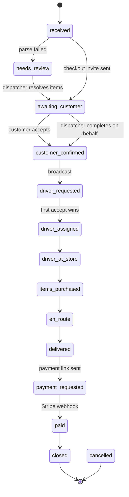

# 04 — Order Lifecycle

The state machine, who may trigger each transition, and what happens as a side effect.

> **Status:** Planned design. Not yet implemented. This document is the specification for `src/lib/orders/state-machine.ts`.

---

## Why this is a single choke point

Every status change in the system goes through one function, `transitionOrder()`. Nothing else writes `orders.status` — not a route handler, not a server action, not a workflow step.

That gives us four things that would otherwise be scattered and eventually inconsistent:

1. **Transition legality** is checked in one place.
2. **Role authorisation** is checked in one place.
3. **The audit event** is always written.
4. **Side effects** (notifications, workflow triggers) are declared per transition rather than remembered per call site.

---

## States

| State | Meaning | Terminal |
|---|---|---|
| `received` | Cart email parsed; order exists but the dispatcher hasn't reviewed it | |
| `needs_review` | Parsing failed. Waiting on a dispatcher to resolve items | |
| `awaiting_customer` | Checkout invite sent; waiting on the customer to verify items, give an address, and accept the price | |
| `customer_confirmed` | Items verified, address captured, price accepted. Ready to dispatch | |
| `driver_requested` | Offered to eligible drivers; no acceptance yet | |
| `driver_assigned` | A driver has accepted | |
| `driver_at_store` | Driver has arrived and is purchasing | |
| `items_purchased` | Materials bought; receipt captured or skipped with a reason | |
| `en_route` | Driver is in transit to the job site | |
| `delivered` | Delivered; delivery photo captured or skipped with a reason | |
| `payment_requested` | Stripe Payment Link sent | |
| `paid` | Payment confirmed by Stripe webhook | |
| `closed` | Order complete | ✓ |
| `cancelled` | Order abandoned | ✓ |

---

## State diagram



---

## Transition table

| # | From | To | Actor | Guard | Side effects |
|---|---|---|---|---|---|
| 1 | — | `received` | system | Parse validated against schema | Email → `parsed`; order number allocated; `order_received_ack` email to customer |
| 2 | — | `needs_review` | system | Both deterministic and LLM extraction failed validation | Email → `needs_review`; internal alert to dispatchers |
| 3 | `needs_review` | `awaiting_customer` | dispatcher | ≥1 item present; retailer store set | Email → `parsed`; `checkout_invite` email sent |
| 4 | `received` | `awaiting_customer` | dispatcher | ≥1 item present; retailer store set; fees entered | `checkout_invite` email sent |
| 5 | `awaiting_customer` | `customer_confirmed` | customer | Delivery address present; total > 0; items non-empty | `customer_confirmed_at` set; `customer_confirmed` email |
| 6 | `awaiting_customer` | `customer_confirmed` | dispatcher | Same as #5 | `confirmed_by_profile_id` **and** `customer_confirmed_at` set (records that a dispatcher acted on the customer's behalf) |
| 7 | `customer_confirmed` | `driver_requested` | dispatcher | Store set; driver pool non-empty | Offers created for all eligible drivers; `job_broadcast` SMS; expiry timer scheduled |
| 8 | `driver_requested` | `driver_assigned` | driver | Offer still `offered`; no other offer accepted | Offer → `accepted`; all other offers → `withdrawn`; `assigned_driver_id` set; `job_assigned` SMS to driver |
| 9 | `driver_requested` | `customer_confirmed` | dispatcher | No driver accepted | All offers → `withdrawn` |
| 10 | `driver_assigned` | `driver_at_store` | driver | Caller is the assigned driver | |
| 11 | `driver_at_store` | `items_purchased` | driver | Caller is the assigned driver | Receipt photo **prompted**; if skipped, `skip_reason` required |
| 12 | `items_purchased` | `en_route` | driver | Caller is the assigned driver | `driver_en_route` email to customer |
| 13 | `en_route` | `delivered` | driver | Caller is the assigned driver | Delivery photo **prompted**; if skipped, `skip_reason` required |
| 14 | `delivered` | `payment_requested` | dispatcher | Total > 0 | Stripe Payment Link created; `payment_request` email |
| 15 | `payment_requested` | `paid` | system | Stripe webhook signature valid; amount matches | `payments.status` → `paid`; `payment_received` email |
| 16 | `paid` | `closed` | system | — | |
| 17 | any non-terminal | `cancelled` | dispatcher | — | *(enum + transition defined; no UI in MVP)* |

### Deliberate omissions

- **No backwards transitions.** A driver cannot un-deliver. Corrections are made by a dispatcher advancing forward or cancelling.
- **No automatic `delivered → payment_requested`.** The dispatcher triggers it, matching the current runbook. Automating it is a one-line change once the process is trusted.
- **No transition out of `needs_review` directly to `received`.** Resolving review produces a valid order and moves to `awaiting_customer` — there is no useful state in between.

---

## Traceability: old runbook statuses

The low-tech process used Google Sheets status names. Every one maps to a state above, so nothing in the original runbook was lost in translation.

| Runbook status | New state | Notes |
|---|---|---|
| Received | `received` | |
| Delivery Address Requested | `awaiting_customer` | Renamed — the state also covers item verification and price acceptance, not just the address |
| *(implicit)* | `customer_confirmed` | Made explicit. The runbook treated this as an email exchange with no status |
| Driver Requested | `driver_requested` | |
| Driver Found | `driver_assigned` | |
| Driver At Store | `driver_at_store` | |
| Items Purchased | `items_purchased` | |
| Driver En Route | `en_route` | |
| Delivered | `delivered` | |
| Payment Requested | `payment_requested` | |
| *(implicit)* | `paid` | Made explicit — previously a dispatcher had to notice the payment arrived |
| Order Final | `closed` | |
| — | `needs_review` | New — parse failures now have a home |
| — | `cancelled` | New — defined but unused in MVP |

Two states became explicit (`customer_confirmed`, `paid`) because both were previously tracked only in a human's head, and both are points where money or commitment changes hands.

---

## Permission matrix

| Transition | Dispatcher | Driver | Customer | System |
|---|---|---|---|---|
| → `received` | | | | ✓ |
| → `needs_review` | | | | ✓ |
| `needs_review` → `awaiting_customer` | ✓ | | | |
| `received` → `awaiting_customer` | ✓ | | | |
| `awaiting_customer` → `customer_confirmed` | ✓ | | ✓ | |
| `customer_confirmed` → `driver_requested` | ✓ | | | |
| `driver_requested` → `driver_assigned` | | ✓ | | |
| `driver_requested` → `customer_confirmed` | ✓ | | | |
| `driver_assigned` → `driver_at_store` | ✓ | ✓ | | |
| `driver_at_store` → `items_purchased` | ✓ | ✓ | | |
| `items_purchased` → `en_route` | ✓ | ✓ | | |
| `en_route` → `delivered` | ✓ | ✓ | | |
| `delivered` → `payment_requested` | ✓ | | | |
| `payment_requested` → `paid` | | | | ✓ |
| `paid` → `closed` | | | | ✓ |
| → `cancelled` | ✓ | | | |

Drivers may only ever act on **their own assigned order**. That check is part of the guard, not a separate authorisation layer.

---

## Invariants

These must hold at all times. They are candidates for database constraints and test assertions.

1. `status = 'customer_confirmed'` implies `delivery_address IS NOT NULL` and `total_cents > 0`.
2. `status` in (`driver_assigned`, `driver_at_store`, `items_purchased`, `en_route`, `delivered`) implies `assigned_driver_id IS NOT NULL`.
3. `status = 'paid'` implies a `payments` row with `status = 'paid'`.
4. `retailer_store_id IS NOT NULL` for every status at or past `awaiting_customer`.
5. At most one `job_offers` row per order has `status = 'accepted'` (partial unique index).
6. Every order has exactly one `order_status_events` row with `from_status IS NULL` — its creation.
7. `order_items` is non-empty for any status at or past `awaiting_customer`.

---

## `transitionOrder()` contract

```ts
type TransitionInput = {
  orderId: string;
  to: OrderStatus;
  actor: { profileId: string | null; role: UserRole | 'system'; source: EventSource };
  note?: string;
  metadata?: Record<string, unknown>;
};

type TransitionResult =
  | { ok: true; order: Order; event: OrderStatusEvent }
  | { ok: false; reason: 'illegal_transition' | 'guard_failed' | 'not_authorised' | 'stale_state'; detail: string };
```

Behaviour:

1. **Load the order `FOR UPDATE`** and re-check the current status. Two concurrent transitions must not both succeed.
2. Look up the transition in the map. Reject `illegal_transition` if absent.
3. Check the actor's role against the matrix. Reject `not_authorised`.
4. Evaluate guards. Reject `guard_failed` with a specific detail.
5. Update `orders`, write the `order_status_events` row, and apply side-effect *intent* in **one transaction**.
6. Emit the side-effect event (`inngest.send`) **after commit**. A notification that fails to enqueue is retried; a notification sent for a rolled-back transaction is a lie.

Step 6 is the subtle one: side effects must be triggered by a committed event, never by the in-transaction code path.

---

## Failure handling

| Situation | Behaviour |
|---|---|
| Illegal transition attempted | Reject; log at `warn`; no state change |
| Guard fails (e.g. no store set) | Reject with a specific, user-facing reason — the console shows "Set a store first", not "invalid transition" |
| Concurrent transition | Second caller gets `stale_state`; the UI refreshes and shows the new state |
| Side-effect enqueue fails | The status change stands (it is already committed); the workflow is retried by Inngest, and `notifications.dedupe_key` prevents a double-send |
| Stripe webhook arrives twice | `payments.stripe_session_id` is unique; the second insert is ignored and the transition is a no-op |
