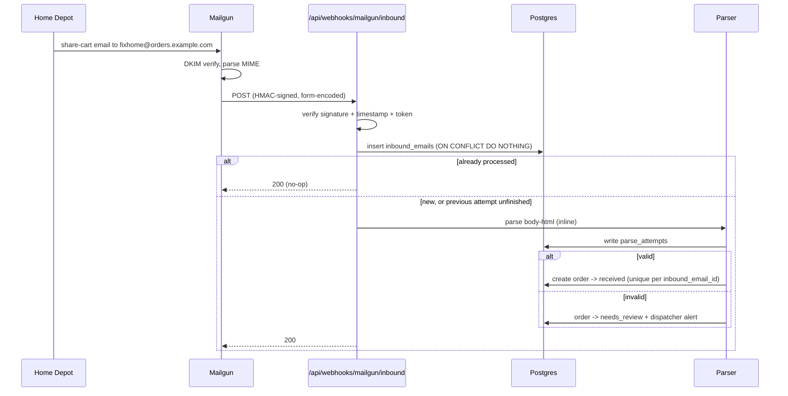

# 05 — Email Intake

How a customer's shared cart becomes a row in `inbound_emails`.

> **Status:** Planned design. Not yet implemented. Depends on the domain prerequisite below.

---

## The critical detail: the sender is the retailer, not the customer

This is the single most important fact about intake, and it is easy to get backwards.

When a customer uses Home Depot's "share cart" feature, **Home Depot sends the email**. The customer is not the sender — they are the subject line:

```
From:    The Home Depot <HomeDepot@order.homedepot.com>
To:      joe.haas@locksmithconsulting.com, notyetsoon@yahoo.com
Subject: Share Cart Invitation From Anthony Palumbi
```

Three consequences:

1. **We cannot attribute an order by sender address.** `order.homedepot.com` sends every customer's cart. Sender-matching would attribute every order to the same company.
2. **Attribution must come from the recipient.** This is exactly why the per-company alias decision is correct and not merely a convenience — it is the only reliable discriminator available. See [ADR-0008](../adr/0008-dispatcher-assigns-store.md) and [03-data-model](03-data-model.md#companies).
3. **The requester's name is in the subject**, in the form `Share Cart Invitation From <name>`.

A customer may also add our alias alongside other recipients, so our address can be one of several in the `To` header. The Mailgun webhook's `recipient` field reports the SMTP envelope recipient that matched our route, which is the value we key on — not the `To` header.

---

## Prerequisites

| # | Prerequisite | Blocks |
|---|---|---|
| 1 | Domain purchased | Everything below |
| 2 | Mailgun account | Everything below |
| 3 | Dedicated inbound subdomain (e.g. `orders.<domain>`) with MX records pointed at Mailgun | Inbound |
| 4 | SPF/DKIM records for outbound sending | Outbound deliverability |
| 5 | A **separate** subdomain for staging (e.g. `orders.staging.<domain>`) | Safe non-production testing |

Prerequisite 5 is not optional. Mailgun routes are scoped per domain, so sharing one domain across environments would deliver every real customer cart email into both production and staging.

---

## Alias scheme

```
<company.order_alias>@orders.<domain>
```

Example: a company with `order_alias = 'fixhome'` receives carts at `fixhome@orders.quickconstruction.example`.

The local part is stored on `companies.order_alias` as `citext` and is unique. The domain is configuration, not data — it lives in an environment variable so staging and production can differ without a migration.

The dispatcher creates the alias when onboarding a company. There is no self-service signup in the MVP.

---

## Mailgun route configuration

Two actions on one route:

```text
Priority: 0
Expression: match_recipient("(?P<alias>[^@]+)@orders\.example\.com")
Actions:
  store(notify="https://<app>/api/webhooks/mailgun/inbound")
  forward("https://<app>/api/webhooks/mailgun/inbound")
```

- **`store()`** retains the original MIME for 3 days, retrievable via the Messages API. This is the recovery path if our webhook is down or the payload is truncated.
- **`forward()`** POSTs the parsed message to us.
- **The named capture `alias`** is available for use in action URLs, but we re-derive it from the `recipient` field rather than trusting the URL, so a misconfigured route cannot silently misattribute orders.

A low-priority `catch_all()` route handles mail to unknown local parts — see [Unknown aliases](#unknown-aliases).

---

## Webhook contract

| Property         | Value                                                                                                                   |
|----------------|-----------------------------------------------------------------------------------------------------------------------|
| Endpoint         | `POST /api/webhooks/mailgun/inbound`                                                                                    |
| Content type     | `application/x-www-form-urlencoded`, or `multipart/form-data` when attachments are present                              |
| Authentication   | Mailgun HMAC signature — see below                                                                                      |
| Success response | `200` with an empty body                                                                                                |
| Target latency   | Under Mailgun's timeout. The deterministic path is sub-second; the LLM fallback (when enabled) runs under a time budget |

### Payload fields we consume

| Field | Use |
|---|---|
| `recipient` | **Authoritative** — derive `recipient_alias` from this |
| `sender` | Retailer envelope sender |
| `from` | Retailer display address |
| `subject` | Requester name extraction |
| `body-html` | **The parser's input** |
| `body-plain` | Not used for parsing — Mailgun synthesizes it when only HTML exists, and the synthesis is lossy |
| `stripped-html` | Quoted-text-stripped variant; a useful cross-check when a customer forwards a cart inside a reply |
| `message-headers` | JSON header list; used for `Message-ID` and DKIM results |
| `timestamp`, `token`, `signature` | Request authentication |
| `attachment-count`, `attachment-N` | Counted and logged; cart emails have none |

### Signature verification

Mailgun signs every `forward()` request with HMAC-SHA256 over `timestamp` + `token` using the account's signing key.

Reject the request unless **all** of the following hold:

1. `signature` matches the computed HMAC (constant-time comparison).
2. `timestamp` is within a tolerance window (reject stale requests — this is the replay guard).
3. The `(timestamp, token)` pair has not been seen before.

Failure returns `406` and writes nothing.

---

## Processing flow



Parsing runs **inline**, before the `200` is returned. The deterministic path is sub-second, so this costs nothing on the common path; a failure is recorded and lands in the review queue rather than being retried blindly.

---

## Idempotency

Mailgun retries on non-2xx and can deliver duplicates. `inbound_emails.mailgun_message_id` is unique, and the insert uses `ON CONFLICT DO NOTHING`.

A retry is treated as **recovery, not a no-op**:

- If the existing row is already `parsed` or `needs_review`, the delivery is a duplicate — return `200` and do nothing.
- If the existing row is still `pending` or `failed` — a previous attempt did not finish — **re-process it**. A retry of a timed-out delivery is exactly the recovery path we want.

Order creation is idempotent on top of this: `orders.inbound_email_id` is unique, so two attempts on the same email cannot produce two orders. The second insert fails the constraint and returns `200`.

---

## Sender authenticity

Anyone can send mail to our alias. Two independent checks:

1. **Mailgun verifies DKIM at the edge** and records the result in `message-headers`. We check that the message was signed by the retailer's domain (`order.homedepot.com` or the Lowe's equivalent) and reject unsigned or mismatched messages.
2. **Retailer identification for parser selection** uses the sender domain. An unverified sender must never select a parser.

A message that fails DKIM is stored with `processing_status = 'ignored'` for visibility but never becomes an order. This is the anti-spoofing boundary: without it, a crafted email could fabricate an order and a driver would be dispatched to buy materials with no legitimate cart behind it.

---

## Unknown aliases

If `recipient_alias` matches no company:

- The email is stored with `processing_status = 'needs_review'`.
- `order_id` stays null.
- It appears in the dispatcher console as an **unattributed inbound email**, where the dispatcher can either attach it to an existing company (creating the order) or dismiss it.

This is the safety net for typos, forwarded carts, and prospects who email us before being onboarded. It is deliberately not an auto-create: silently creating companies from unverified inbound mail is how a spam flood becomes a customer database.

---

## What is out of scope

- Attachment parsing. Cart emails are HTML-only; `attachment-count` is logged as a signal that the retailer changed their template.
- Inbound customer replies. Replies go to the portal, not to email. A reply to our alias lands in the unknown-alias queue rather than being interpreted.
- Spam filtering. Mailgun's edge filtering plus DKIM verification is the MVP posture.
