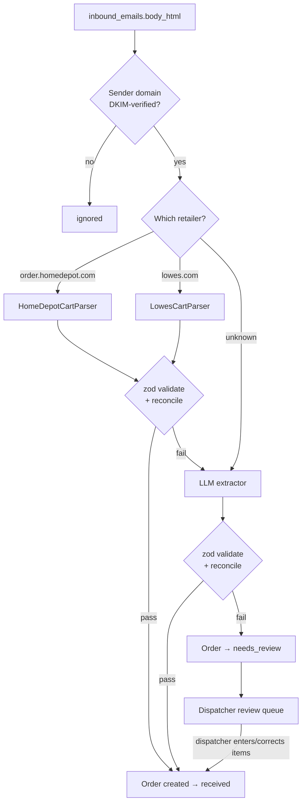

# 06 — Cart Parsing

Turning a retailer's share-cart email into validated line items.

> **Status:** Planned design. Not yet implemented. Depends on [05-email-intake](05-email-intake.md).

---

## Approach

A deterministic HTML parser per retailer, with an LLM fallback and a human backstop. Three tiers, one shared output schema:



Tier 1 is free, instant, and exact. Tier 2 handles template drift and new retailers. Tier 3 handles everything else without blocking a customer's order.

**Every attempt is recorded in `parse_attempts`** with strategy, parser version, output, and validation errors. Silent drift is the failure mode we are guarding against: a retailer changing a table class would otherwise quietly produce wrong orders.

---

## Why deterministic first

The sample email contains every field we need, in stable, identifiable markup. Given that, sending it to an LLM would be paying per email, accepting non-determinism, and adding a vendor dependency to solve a problem that is already solved.

The LLM tier exists for the cases we *cannot* enumerate — not as the primary path. See [ADR-0004](../adr/0004-deterministic-parser-with-llm-fallback.md).

---

## Parser interface

```ts
interface CartParser {
  readonly retailer: Retailer;
  readonly version: string;                    // e.g. 'homedepot@1.0.0'
  matches(senderDomain: string): boolean;
  parse(html: string, subject: string): ParseResult;
}

type ParseResult = {
  ok: true;
  data: ParsedCart;                            // matches CartSchema
  warnings: string[];
} | {
  ok: false;
  reason: string;
  partial?: unknown;                           // best-effort, for diagnostics
};
```

A parser that throws is a bug; a parser that returns `ok: false` is an expected outcome. Failures are data, not exceptions.

---

## Home Depot field map

Derived by inspecting a real share-cart email. All selectors below are scoped to `hide_mobile_view` subtrees — see [the duplicate-view trap](#the-duplicate-view-trap).

| Field | Location | Notes |
|---|---|---|
| Requester name | Email `Subject` | Regex `Share Cart Invitation From (.+)` |
| Item list root | `table.desktop_item_list` | 17KB of nested tables in the sample |
| Item rows | `tr` elements within that table containing `img[alt="Product Image"]` | Row-oriented, not positional |
| Product image | `img[alt="Product Image"]` → `src` | `https://images.thdstatic.com/productImages/…` |
| Brand | Text of the `<b>` inside the product anchor | Rendered as `<b>DECKMATE</b>2-Pack #9 x 3 in. …` |
| Description | Product anchor text with the brand prefix removed | |
| Model # | Regex `Model\s*#(\S+)` in the product cell | `9988872` |
| Store SKU # | Regex `Store SKU\s*#(\S+)` in the product cell | `1014148280` |
| Aisle / Bay | Cell with `width:150px` in the item row | Labels present, **values empty in the sample** |
| Quantity | Cell with `width:62px` in the item row | `1` |
| Line total | Cell with `width:78px` in the item row | `$216.60` → `21660` |
| Subtotal / Shipping / Sales Tax / Est. Total | `table.sub-total-view.hide_mobile_view`, rows pairing `span.total-heading` with the adjacent value span | |

### Item row structure

Each item is one `<tr>` whose direct `<td>` children are, in order:

```
<tr>
  <td>                          <!-- product: nested table with image + name + model + sku -->
  <td style="…width:150px">     <!-- aisle / bay -->
  <td style="…width:62px">      <!-- quantity -->
  <td style="…width:78px">      <!-- line total -->
</tr>
```

Extraction is therefore **row-relative**, not a global selector sweep. This matters: `width:150px` also appears on the *header* row (the "In Store" column heading), so a naive global selector would pick up the header as if it were an item.

### The duplicate-view trap

The email is built for both desktop and mobile clients and contains **the entire cart twice**:

| View | Class | CSS |
|---|---|---|
| Desktop | `hide_mobile_view desktop_item_list` | visible |
| Mobile | `visible_mobile_view mobile_item_list` | `display:none` |

The totals are duplicated the same way (`sub-total-view hide_mobile_view` vs `sub-total-view visible_mobile_view` and `order-total visible_mobile_view`).

A parser that ignores this produces **every order with double the items**. The general rule is therefore:

> **Parse only `hide_mobile_view` subtrees. Never match on a class or element outside one.**

This rule applies to items *and* totals, and should be asserted in tests rather than assumed — the de-duplication check in [validation](#validation) is the backstop.

### Derived fields

`unit_price_cents` is **not** in the email. Only a per-line `Item Total` is printed. Unit price is derived as `line_total_cents / quantity`, and for `quantity > 1` it may not divide evenly. The line total is authoritative for all money; the unit price is display-only. See [03-data-model](03-data-model.md#order_items).

---

## Validation

All three tiers produce the same shape and pass the same validation. This is what makes the fallback ladder safe — an LLM cannot introduce a structure the rest of the system doesn't already handle.

```ts
const CartSchema = z.object({
  retailer: z.enum(['homedepot', 'lowes']),
  requesterName: z.string().nullable(),
  items: z.array(z.object({
    lineNo: z.number().int().nonnegative(),
    brand: z.string().nullable(),
    description: z.string().min(1),
    modelNumber: z.string().nullable(),
    storeSku: z.string().nullable(),
    quantity: z.number().int().positive(),
    lineTotalCents: z.number().int().nonnegative(),
    imageUrl: z.string().url().nullable(),
    aisle: z.string().nullable(),
    bay: z.string().nullable(),
  })).min(1),
  totals: z.object({
    subtotalCents: z.number().int().nonnegative(),
    shippingCents: z.number().int().nonnegative(),
    taxCents: z.number().int().nonnegative(),
    estimatedTotalCents: z.number().int().nonnegative(),
  }),
});
```

### Semantic checks beyond the schema

Schema validation alone accepts plausible garbage. These checks are what actually establish that we read the email correctly:

| Check | Rationale |
|---|---|
| `Σ lineTotalCents === subtotalCents` (within 1 cent tolerance) | **The strongest correctness signal.** If we parsed the wrong rows, or double-parsed the two views, the arithmetic will not reconcile |
| `estimatedTotalCents === subtotal + shipping + tax` | Catches misread totals |
| No two items share `(modelNumber, quantity, lineTotalCents)` | Direct de-duplication guard for the two-view trap |
| Every item has a `description` | |
| `items.length ≥ 1` | An empty cart is a failure, not an order |

A cart that fails reconciliation is treated as a **parse failure** and escalates to the next tier. Reconciling to the penny against a number the retailer computed independently is a far better signal than any confidence score.

---

## LLM fallback contract

| Aspect | Rule |
|---|---|
| Trigger | Deterministic parser returned `ok: false`, or its output failed validation |
| Input | `body_html` with `<style>`, `<script>`, HTML comments, and tracking URLs stripped; truncated to a fixed budget |
| Output | JSON conforming to `CartSchema` |
| Validation | **Identical** to the deterministic path, including reconciliation |
| Model + token usage | Recorded on `parse_attempts` |
| On failure | Order → `needs_review`; never a partially-populated order |
| PII | Only what the retailer already placed in the cart email. No customer identifiers are added |

An LLM response is never trusted on its own. It is a candidate that must reconcile arithmetically before it becomes an order.

---

## Review queue

When both tiers fail, the order is created in `needs_review` and surfaces in the dispatcher console with the raw email rendered beside an editable item table.

The dispatcher either corrects the parsed items or enters them, and the order advances to `awaiting_customer`. This is the only manual item-entry path in the system — and note that the order still originates from a real email, consistent with the email-intake-only decision.

The manual path writes a `parse_attempts` row with `strategy = 'manual'`, so we can measure how often automation actually succeeds.

---

## Testing

**Golden-file tests.** Each fixture is a real `.eml` committed under `src/lib/parsers/__fixtures__/`, with an expected JSON snapshot. The test parses and asserts deep equality.

| Fixture | Status |
|---|---|
| `homedepot/single-item.eml` | **Available** — the sample in `External Notes/` |
| `homedepot/multi-item.eml` | **Needed** — see below |
| `homedepot/empty-cart.eml` | **Needed** |
| `lowes/*.eml` | **Needed** — see below |

**Replay tests.** Because `inbound_emails.body_html` is retained, any historical email can be re-parsed against a new parser version in CI. This is how we prove a parser fix doesn't regress older carts.

**Contract tests.** The LLM fallback is tested against a fixed recorded response, so CI never calls a live model.

---

## Known unknowns

Being explicit about these, because they are real gaps rather than hypotheticals:

1. **Multi-item carts are unverified.** The sample contains exactly one item. The row structure above is inferred to repeat, but that has not been observed. A multi-item fixture is required before the parser can be considered done — and the reconciliation check is the guard that will catch it if the inference is wrong.
2. **The Lowe's email format is unknown.** `LowesCartParser` cannot be specified until a real Lowe's share-cart email is captured. Until then, Lowe's carts route to the LLM tier, which is a working but costlier path. This is open blocker #1 in [00-overview](00-overview.md).
3. **Aisle/Bay values were empty.** The columns exist and are parsed, but no sample has ever had values in them. Whether Home Depot populates them for in-store-available items is unknown — which is why aisle data is deferred rather than built on.

---

## Parser versioning

Parser version strings (`homedepot@1.0.0`) are recorded on every `parse_attempts` row. When a retailer changes their template:

1. A drift alert fires from the reconciliation failure rate.
2. A new fixture is captured and the parser is bumped.
3. Replay tests confirm old emails still parse.
4. The new version ships; the drift rate is confirmed back to zero.

Without versioning, "parsing broke last Tuesday" is unanswerable.
