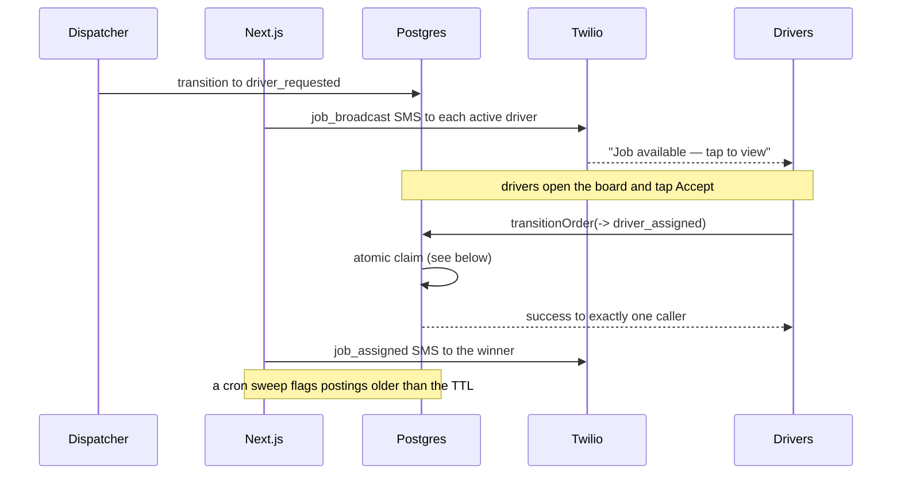

# 07 — Dispatch

Posting a confirmed order to drivers and resolving the race when several accept.

> **Status:** Planned design. Not yet implemented. See [04-order-lifecycle](04-order-lifecycle.md) for the transition this drives.

---

## Flow



---

## Postings, not offers

A `driver_requested` order **is** the posting. Every active driver sees every open posting on the job board; there is no per-driver offer row and no per-driver offer status.

This is a deliberate simplification for the MVP's scale (a handful of companies, a few drivers):

- The board is a query over `orders` in `driver_requested`, not a table of offers.
- The only dispatch state that matters — who has the job — lives in one place: `orders.assigned_driver_id`.
- The one per-driver fact worth keeping is a decline, recorded as a plain row ([below](#declines)) rather than as a status.

If targeted dispatch (per-driver offers, geographic or vehicle filtering) is ever needed, it can be added then. Nothing about `orders` changes.

---

## Eligibility

A driver is alerted about a posting when all hold:

| Condition                  | Source                                                                          |
| -------------------------- | ------------------------------------------------------------------------------- |
| `profiles.role = 'driver'` |                                                                                 |
| `profiles.active = true`   |                                                                                 |
| Has a phone number         | Required for SMS; a driver with no phone still sees the board but gets no alert |

The MVP has a single market (Greenville/Spartanburg, SC), so there is no geographic filtering. When a second market is added, an eligibility predicate on `retailer_stores` location is the natural extension point.

---

## First-accept-wins

This is the only genuine concurrency hazard in the system, and it is settled by the state transition itself.

Acceptance is the `driver_requested → driver_assigned` transition. `transitionOrder()` already loads the order `FOR UPDATE` and re-checks the current status inside the transaction, so two concurrent accepts serialise on the order row: the second reads `driver_assigned`, finds no legal transition, and is rejected with a clean "already taken" message. There is no second write path and no separate claim function.

Equivalently, the whole claim is one conditional statement:

```sql
update orders
   set assigned_driver_id = $driver, status = 'driver_assigned', updated_at = now()
 where id = $order
   and status = 'driver_requested'
   and assigned_driver_id is null
returning id;
```

Postgres re-evaluates the predicate after the row lock is released, so the loser matches zero rows. Application-level checks (`SELECT` then `UPDATE`) are not sufficient — the guard lives in the transition.

The `driver_requested → driver_assigned` transition is the **only** writer of `orders.assigned_driver_id`.

Guard: the caller is a driver, the order is `driver_requested`, and no driver is assigned. A retried Accept from the winner (double-tap, network retry) is treated as success rather than an error.

---

## Declines

A driver who cannot take a posting taps **Decline**, which inserts one row:

```
job_declines
  id, order_id FK, driver_id FK, reason text null, created_at
  UNIQUE (order_id, driver_id)
```

- A decline does not change the order's status and does not affect other drivers.
- The dispatcher is notified of each decline and sees who declined on the order.
- The posting disappears from that driver's board — `get_open_jobs_for_driver()` excludes orders the caller has declined.
- When every active driver has declined, the order is flagged **nobody available** in the console. That is the escalation signal: a human needs to widen the pool or call around.

A decline has no concurrency hazard — the insert is idempotent via the unique constraint.

---

## Broadcast expiry

A cron sweep runs every few minutes and looks for orders still `driver_requested` past the broadcast TTL. It notifies the dispatcher once per order — through the notification outbox, so `dedupe_key` prevents repeats — including who has declined.

The dispatcher can then re-broadcast (transition `driver_requested → customer_confirmed → driver_requested`) or widen the pool. The MVP does **not** auto-rebroadcast — an unfilled order is a signal a human should see.

---

## Withdrawal and reassignment

| Action                             | Effect                                                                                          |
| ---------------------------------- | ----------------------------------------------------------------------------------------------- |
| Driver declines                    | A `job_declines` row. The order stays `driver_requested`; other drivers are unaffected          |
| Dispatcher withdraws the broadcast | Order returns to `customer_confirmed`; the posting leaves every board                           |
| Order cancelled                    | The posting leaves every board                                                                  |
| Assigned driver falls through      | Dispatcher clears the assignment, returns the order to `customer_confirmed`, then re-broadcasts |

Every one of these is recorded in `order_status_events`. There is no separate offer record to reconcile.

---

## What is out of scope

- Automatic re-broadcast on expiry
- Targeted or filtered dispatch (per-driver offers)
- Driver ratings or reliability scoring affecting eligibility
- Distance-based or vehicle-capacity matching
- Scheduled or batched dispatch
- Driver payouts (see [12-deferred-and-extension-points](12-deferred-and-extension-points.md))
