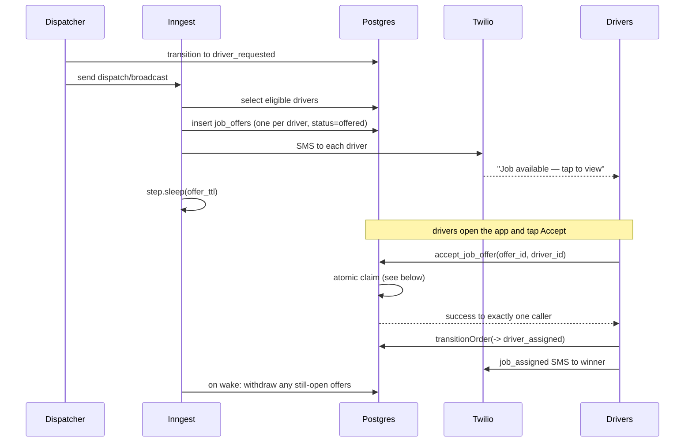

# 07 — Dispatch

Offering a confirmed order to drivers and resolving the race when several accept.

> **Status:** Planned design. Not yet implemented. See [04-order-lifecycle](04-order-lifecycle.md) for the transition this drives.

---

## Flow



---

## Eligibility

A driver is offered a job when all hold:

| Condition | Source |
|---|---|
| `profiles.role = 'driver'` | |
| `profiles.active = true` | |
| Has a phone number | Required for SMS; a driver with no phone still sees the in-app board but gets no alert |

The MVP has a single market (Greenville/Spartanburg, SC), so there is no geographic filtering. When a second market is added, an eligibility predicate on `retailer_stores` location is the natural extension point.

---

## Offers

One `job_offers` row per eligible driver, created in a single batch, all with `status = 'offered'` and a shared `expires_at`.

The broadcast is **fan-out, not assignment**: we do not pick a driver, we make the job visible and let the first qualified driver claim it. This matches the existing Slack behaviour (`I'll take it` in a thread) while removing the dispatcher from the loop.

---

## First-accept-wins

This is the only genuine concurrency hazard in the system, and it must be solved in the database.

Two drivers tapping Accept within the same few hundred milliseconds is not an edge case — it is the expected behaviour of a broadcast. If the check is done in application code (`SELECT` then `UPDATE`), both callers read `offered`, both proceed, and the order ends up with two assigned drivers, one of whom drives to a store for nothing.

### Two layers of defence

**Layer 1 — a partial unique index** makes the bad state unrepresentable:

```sql
create unique index job_offers_one_accepted_per_order
  on job_offers (order_id)
  where status = 'accepted';
```

Even if application logic were wrong, the second concurrent `UPDATE` to `accepted` fails at the constraint.

**Layer 2 — an atomic claim function** turns the race into a queue:

```sql
create or replace function accept_job_offer(p_offer_id uuid, p_driver_id uuid)
returns table (success boolean, order_id uuid, reason text)
language plpgsql
security definer
set search_path = public
as $$
declare
  v_order_id uuid;
  v_status   job_offer_status;
begin
  -- Lock this driver's offer.
  select order_id, status
    into v_order_id, v_status
    from job_offers
   where id = p_offer_id
     and driver_id = p_driver_id
     for update;

  if not found then
    return query select false, null::uuid, 'offer_not_found';
    return;
  end if;

  if v_status <> 'offered' then
    return query select false, v_order_id, 'offer_no_longer_open';
    return;
  end if;

  -- Serialise on the order itself: concurrent accepts queue here.
  perform 1 from orders where id = v_order_id for update;

  if exists (
    select 1 from job_offers
     where order_id = v_order_id and status = 'accepted'
  ) then
    return query select false, v_order_id, 'already_assigned';
    return;
  end if;

  update job_offers
     set status = 'accepted', responded_at = now()
   where id = p_offer_id;

  update job_offers
     set status = 'withdrawn', responded_at = now()
   where order_id = v_order_id
     and id <> p_offer_id
     and status = 'offered';

  update orders
     set assigned_driver_id = p_driver_id, updated_at = now()
   where id = v_order_id;

  return query select true, v_order_id, null::text;
end;
$$;
```

Locking the **order** row is what serialises the race: the first caller holds it through commit, so the second sees `already_assigned` and is rejected cleanly rather than failing on a constraint violation.

### Division of responsibility

`accept_job_offer()` owns *the claim* — it is the concurrency gate. `transitionOrder()` owns *the state machine* — it is called immediately afterwards with `→ driver_assigned`.

They stay separate because they answer different questions: "who won?" versus "is this transition legal and who may make it?". The transition's guard is "an accepted offer exists for this order", which is now uniquely true for exactly one driver, so only the winner's call can succeed.

`accept_job_offer` is `security definer` and is the only function that writes `job_offers.status` and `orders.assigned_driver_id` directly.

---

## Offer expiry

An Inngest `step.sleep` holds the workflow open for the offer TTL. On wake it:

- withdraws any offers still `offered`, and
- if nothing was accepted, leaves the order in `driver_requested` and notifies the dispatcher.

The dispatcher can then re-broadcast (transition `driver_requested → customer_confirmed → driver_requested`) or widen the pool. The MVP does **not** auto-rebroadcast — an unfilled order is a signal a human should see.

---

## Decline and withdrawal

| Action | Effect |
|---|---|
| Driver declines | Their offer → `declined`. The order stays `driver_requested`; other offers unaffected |
| Dispatcher withdraws | All open offers → `withdrawn`; order returns to `customer_confirmed` |
| Order cancelled | All open offers → `withdrawn` |

A decline is deliberately **not** broadcast to the dispatcher as an alert. Ten drivers declining a job is noise; zero drivers accepting is signal, and the expiry path already surfaces that.

---

## Reassignment

If an assigned driver becomes unavailable after accepting, the dispatcher withdraws the assignment and returns the order to `customer_confirmed`, then re-broadcasts. The original offer stays `accepted` in the audit trail but the order's `assigned_driver_id` is cleared.

There is no driver-initiated release in the MVP. A driver who cannot complete a job contacts the dispatcher, which keeps a human in the loop for the case that most affects a customer.

---

## What is out of scope

- Automatic re-broadcast on expiry
- Driver ratings or reliability scoring affecting eligibility
- Distance-based or vehicle-capacity matching
- Scheduled or batched dispatch
- Driver payouts (see [12-deferred-and-extension-points](12-deferred-and-extension-points.md))
