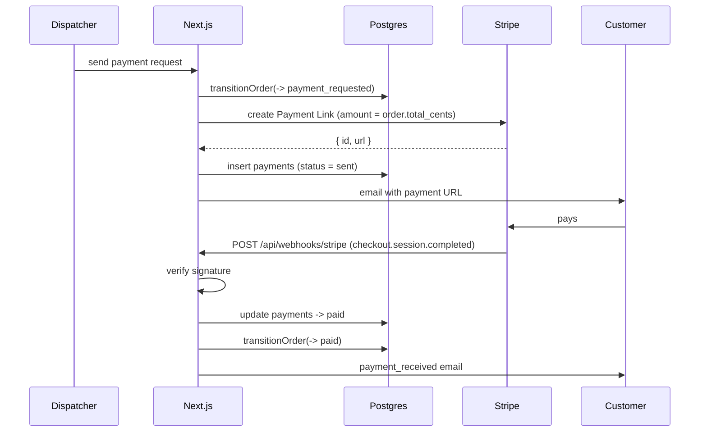

# 09 — Payments

Collecting the delivery total with Stripe Payment Links.

> **Status:** Planned design. Not yet implemented. See [04-order-lifecycle](04-order-lifecycle.md) for the `payment_requested → paid` transition.

---

## Why Payment Links, not Checkout Sessions

Both are Stripe-hosted and keep card data off our servers. Payment Links are chosen because:

| | Payment Links | Checkout Sessions |
|---|---|---|
| Created ahead of need | Yes — a reusable link object exists independently of a customer session | No — a session is per-attempt and expires |
| Fits the workflow | The dispatcher sends a link when the job is done, on their own timing | Requires the customer to be present in a live session |
| Link re-sendable | Yes — the same URL can be re-sent if the customer loses it | Requires minting a new session |
| Amount | Fixed per link | Fixed per session |

The workflow is "the job is done, now pay" — triggered by a human at an unpredictable moment, often hours after checkout. A durable, re-sendable URL matches that far better than a session that must be created while the customer is watching.

See [ADR-0006](../adr/0006-stripe-payment-links.md).

---

## Flow



---

## Amount authority

**`orders.total_cents` is the single source of truth for the amount charged.** It is computed at confirmation time from:

```
total_cents = materials_subtotal_cents
            + sizing_fee_cents
            + mileage_fee_cents
            - discount_cents
            + tax_cents
```

The Payment Link is created with that exact value. If the customer edits quantities or the dispatcher changes fees *after* a link was created, the existing link is stale and must be expired and recreated — the app must never accept payment for an amount that no longer matches the order.

This is enforced by storing `payments.amount_cents` at creation and comparing it to `orders.total_cents` in the webhook. A mismatch is a reconciliation alert, not a silent success.

---

## Webhook

| Property       | Value                                                         |
|--------------|-------------------------------------------------------------|
| Endpoint       | `POST /api/webhooks/stripe`                                   |
| Verification   | Stripe signature header, verified against the endpoint secret |
| Events handled | `checkout.session.completed`                                  |
| Response       | `200` after the webhook is processed                          |

Handling:

1. Verify the signature. Reject unsigned or invalid requests with `400`.
2. Look up `payments` by `stripe_session_id` (unique). If absent, the event is for a link we don't know about — log and `200`.
3. If already `paid`, return `200` — Stripe retries, and this must be a no-op.
4. Compare `amount_total` against `payments.amount_cents`. A mismatch sets a reconciliation flag and does **not** mark the order paid.
5. Update `payments` → `paid`, then call `transitionOrder(order, 'paid')`.
6. Send `payment_received` (outbox row + immediate attempt).

The `payments.stripe_session_id` unique constraint is what makes step 3 safe under Stripe's at-least-once delivery.

---

## Reconciliation

Payment state can drift from order state in ways that must be visible rather than assumed:

| Situation | Detection | Resolution |
|---|---|---|
| Paid but order not `paid` | Webhook failed after Stripe succeeded | Dispatcher console shows paid-but-not-advanced; dispatcher advances manually |
| Order `payment_requested` for days | Aging query on `payments.status = 'sent'` | Dispatcher re-sends or follows up by phone |
| Amount mismatch | Webhook comparison in step 4 | Flagged; never auto-marked paid |
| Link expired unpaid | Stripe webhook | `payments.status → expired`; dispatcher can issue a new link |

The MVP surfaces these in the dispatcher console. There is no automated reconciliation job — that is a hardening-phase addition.

---

## Environments

| Environment | Stripe mode | Key |
|---|---|---|
| Local | Test | `sk_test_…` |
| Preview / staging | Test | `sk_test_…`, separate webhook endpoint |
| Production | Live | `sk_live_…` |

Stripe webhook endpoints are configured per environment, each with its own signing secret. A test-mode link must never be sent to a real customer — the app asserts that the key's mode matches the environment on startup.

---

## What is out of scope

- Refunds and partial refunds (the `refunded` status exists in the enum; no UI)
- Driver payouts via Stripe Connect — this is a significant addition requiring driver KYC and tax handling
- Subscription or prepaid bucket billing, both raised in the source material
- Storing cards or using Stripe Elements — Payment Links means we never touch card data at all
- Tips
