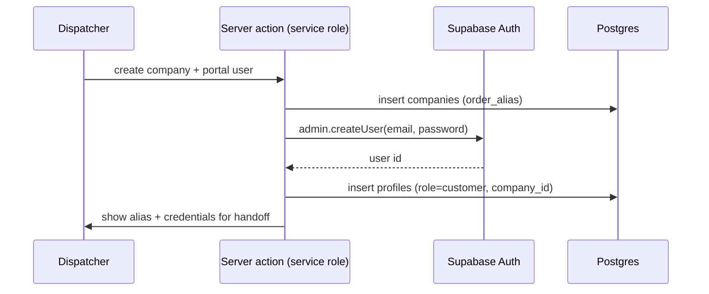

# 10 — Auth & Permissions

Identity, route guards, and the Row Level Security policies that enforce access.

> **Status:** Planned design. Not yet implemented. RLS policies ship in the same migration as their tables.

---

## Auth model

Supabase Auth with **email as the username and a password**. No magic links, no SSO.

| Aspect      | Decision                                                     |
| ----------- | ------------------------------------------------------------ |
| Identifier  | Email address                                                |
| Credential  | Password (Supabase-managed, bcrypt)                          |
| Sessions    | Supabase JWT in an HTTP-only cookie, refreshed by middleware |
| MFA         | Out of scope for MVP                                         |
| Self-signup | **Disabled.** All accounts are created by a dispatcher       |

Self-signup is disabled because every user belongs to a company or the dispatch team. An uninvited account has no valid `profiles` row and would be unable to do anything — better to not create it at all.

See [ADR-0007](../adr/0007-email-password-auth.md).

---

## Roles

`profiles.role` is the single authority. It is **never** read from a client-supplied value.

| Role         | Scope                          | Bound to     |
| ------------ | ------------------------------ | ------------ |
| `dispatcher` | All data                       | Nothing      |
| `driver`     | Own declines and assigned jobs | —            |
| `customer`   | Own company's data             | `company_id` |

A fourth concept — **admin** — is not a role. Dispatchers hold administrative permissions, so there is no separate admin account to manage in the MVP.

---

## Route guards

| Route group       | Required role             | Behaviour on failure |
| ----------------- | ------------------------- | -------------------- |
| `/dispatch/*`     | `dispatcher`              | Redirect to `/login` |
| `/driver/*`       | `driver`                  | Redirect to `/login` |
| `/portal/*`       | `customer`                | Redirect to `/login` |
| `/login`          | none                      | —                    |
| `/api/webhooks/*` | none — signature-verified | `400` / `406`        |

Route guards are a **UX affordance, not a security boundary**. They stop a driver from seeing a dispatcher page; they do not protect data. RLS does that, and it holds even if a guard is bypassed or a route is added without one.

Middleware reads the role from the JWT claim and redirects cross-role access to the correct home for that role rather than to a dead end.

---

## User provisioning

Because self-signup is off, account creation uses the Supabase **admin API**, which requires the secret key (`sb_secret_...`). That key must never reach the browser.



| Role         | Provisioning                                                                                              |
| ------------ | --------------------------------------------------------------------------------------------------------- |
| `customer`   | Dispatcher creates the company, then one portal login. Credentials are handed over out-of-band in the MVP |
| `driver`     | Dispatcher creates the account; driver can change their password after first login                        |
| `dispatcher` | Created manually via the Supabase dashboard. There is no in-app path to create a dispatcher               |

The absence of an in-app dispatcher-creation path is deliberate: it is the one account type that can see everything, and it should require direct database access to create.

---

## RLS helper functions

Policies that query `profiles` from within a policy on `profiles` recurse infinitely. These `security definer` helpers break the cycle and are `stable` so they're evaluated once per statement.

```sql
create or replace function public.is_dispatcher() returns boolean
language sql security definer stable set search_path = public as $$
  select exists (
    select 1 from profiles
     where id = auth.uid() and role = 'dispatcher' and active
  )
$$;

create or replace function public.current_company_id() returns uuid
language sql security definer stable set search_path = public as $$
  select company_id from profiles where id = auth.uid() and active
$$;

create or replace function public.is_driver() returns boolean
language sql security definer stable set search_path = public as $$
  select exists (
    select 1 from profiles
     where id = auth.uid() and role = 'driver' and active
  )
$$;
```

`security definer` functions must always pin `search_path`. Without it, a caller can shadow `profiles` with a table in a schema they control and subvert the check.

---

## Policies

RLS is enabled on every table in `public`. Default posture: **deny**. Access is granted explicitly.

### Reference data

```sql
alter table companies enable row level security;

create policy companies_select on companies for select using (
  is_dispatcher() or id = current_company_id()
);
create policy companies_write on companies for all
  using (is_dispatcher()) with check (is_dispatcher());
```

Same shape for `company_sites` (scoped by `company_id`) and `retailer_stores` (readable by everyone authenticated, writable by dispatchers only).

### Orders

```sql
alter table orders enable row level security;

-- Dispatchers see everything.
create policy orders_dispatcher on orders for all
  using (is_dispatcher()) with check (is_dispatcher());

-- Customers see their own company's orders.
create policy orders_customer on orders for select using (
  company_id = current_company_id()
);

-- Drivers see only orders assigned to them.
create policy orders_driver on orders for select using (
  is_driver() and assigned_driver_id = auth.uid()
);
```

**Drivers deliberately cannot select `orders` for postings they have not accepted.** A posting must show the store and the item count — a driver deciding whether to accept needs to know what they're taking on — but must **not** reveal the customer's address, contact, or instructions before they commit.

That is served by a redacted read path instead:

```sql
create or replace function public.get_open_jobs_for_driver()
returns table (
  order_id uuid, order_number text, retailer retailer,
  store_name text, store_address text, item_count int, posted_at timestamptz
)
language sql security definer stable set search_path = public as $$
  select ord.id, ord.order_number, ord.retailer,
         s.name, s.address_line1, count(i.id), ord.updated_at
    from orders ord
    left join retailer_stores s on s.id = ord.retailer_store_id
    left join order_items i on i.order_id = ord.id
   where ord.status = 'driver_requested'
     and not exists (
       select 1 from job_declines d
        where d.order_id = ord.id and d.driver_id = auth.uid()
     )
   group by ord.id, s.name, s.address_line1
$$;
```

The delivery address appears only after assignment, through the normal `orders` policy. **Redaction is structural, not a UI concern** — the address is not in the function's return type at all.

### Order children

`order_items`, `order_status_events`, and `attachments` inherit visibility from their order:

```sql
create policy order_items_read on order_items for select using (
  exists (select 1 from orders o where o.id = order_items.order_id)
);
```

The subquery is itself subject to the `orders` policies, so visibility composes correctly for all three roles without restating the rules.

### Job declines

```sql
create policy job_declines_driver_insert on job_declines for insert
  with check (driver_id = auth.uid());

create policy job_declines_read on job_declines for select using (
  driver_id = auth.uid() or is_dispatcher()
);
```

Drivers may insert and read only their own declines. Acceptance is not writable at all: it is the `driver_requested → driver_assigned` transition, and drivers hold no write policy on `orders`, so an assignment cannot be fabricated by writing rows directly.

### Notifications, payments, inbound email

```sql
-- Notifications: dispatchers only.
create policy notifications_dispatcher on notifications for all
  using (is_dispatcher()) with check (is_dispatcher());

-- Payments: dispatchers write; customers may read their own company's.
create policy payments_dispatcher on payments for all
  using (is_dispatcher()) with check (is_dispatcher());
create policy payments_customer_read on payments for select using (
  exists (select 1 from orders o where o.id = payments.order_id
            and o.company_id = current_company_id())
);

-- Inbound email and parse attempts: dispatchers only.
create policy inbound_emails_dispatcher on inbound_emails for all
  using (is_dispatcher()) with check (is_dispatcher());
```

`inbound_emails` holds raw customer email including any PII the retailer embedded. It is dispatcher-only and is never exposed to customers or drivers.

---

## Service role usage

The secret key (`sb_secret_...`, formerly the `service_role` key) bypasses RLS entirely. It appears in exactly three places:

| Location                                                 | Why                                                                      |
| -------------------------------------------------------- | ------------------------------------------------------------------------ |
| Webhook route handlers (Mailgun, Stripe)                 | No user context exists; the caller is a provider                         |
| Cron sweep routes (`/api/cron/*`)                        | Scheduled work runs with no session; protected by a shared-secret header |
| Admin actions in the dispatcher console (creating users) | The Supabase admin API requires it                                       |

Rules that keep this safe:

1. The service role client lives in `lib/supabase/admin.ts` and is **never** imported into a client component or a route group.
2. Server actions that use it must independently verify the caller's role first — RLS will not do it for them.
3. Every service-role code path is listed above. Adding a fourth requires updating this document.

The risk is concrete: a server action that uses the service role and forgets to check the caller's role is a full data breach. That is why the list is short and enumerated.

---

## Permission matrix

| Action                                 | Dispatcher | Driver           | Customer   |
| -------------------------------------- | ---------- | ---------------- | ---------- |
| View all orders                        | ✓          |                  |            |
| View own company's orders              |            |                  | ✓          |
| View assigned job                      | ✓          | ✓                |            |
| View an open posting (unaccepted)      | ✓          | ✓ redacted       |            |
| See delivery address                   | ✓          | after assignment | own orders |
| Edit order items                       | ✓          |                  |            |
| Set retailer store                     | ✓          |                  |            |
| Set fees                               | ✓          |                  |            |
| Complete checkout on customer's behalf | ✓          |                  |            |
| Complete own checkout                  |            |                  | ✓          |
| Broadcast to drivers                   | ✓          |                  |            |
| Accept a job                           |            | ✓                |            |
| Decline a posting                      |            | ✓                |            |
| Advance delivery status                | ✓          | ✓ assigned only  |            |
| Upload evidence                        | ✓          | ✓ assigned only  |            |
| Send payment request                   | ✓          |                  |            |
| Create companies, users, stores        | ✓          |                  |            |
| Read inbound email                     | ✓          |                  |            |

---

## Session and password handling

| Concern              | Approach                                                                                                                                       |
| -------------------- | ---------------------------------------------------------------------------------------------------------------------------------------------- |
| Session storage      | HTTP-only, `Secure`, `SameSite=Lax` cookie set by Supabase                                                                                     |
| Refresh              | Middleware refreshes on navigation                                                                                                             |
| Password reset       | Supabase's email reset flow, using Mailgun as the SMTP provider                                                                                |
| Password policy      | Minimum length enforced by Supabase; no forced rotation                                                                                        |
| Account deactivation | `profiles.active = false` — the helper functions all check it, so a deactivated user loses access immediately while their history is preserved |
| Deleted users        | Never deleted. `active = false` preserves order history and audit integrity                                                                    |
