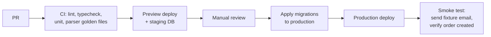

# 11 — Deployment & Environments

Environments, configuration, prerequisites, and the release process.

> **Status:** Planned design. Not yet implemented — no Supabase project exists yet. The base schema is written (`supabase/migrations/0001_baseline.sql`); the prerequisites below are Phase 1 work.

---

## Environments

|                  | Local                         | Preview / Staging         | Production                   |
| ---------------- | ----------------------------- | ------------------------- | ---------------------------- |
| App              | `next dev`                    | Vercel preview deploy     | Vercel production            |
| Database         | Supabase CLI (local Postgres) | Staging Supabase project  | Production Supabase project  |
| Inbound email    | Mailgun sandbox subdomain     | `orders.staging.<domain>` | `orders.<domain>`            |
| Outbound email   | Mailgun sandbox               | Mailgun staging subdomain | Mailgun production subdomain |
| SMS              | Twilio test credentials       | Twilio test credentials   | Twilio live                  |
| Payments         | Stripe test                   | Stripe test               | Stripe live                  |
| Scheduled sweeps | Call the cron routes manually | Manual (cron disabled)    | Vercel Cron                  |

### Why staging needs its own email subdomain

Mailgun routes are scoped to a **domain**, not a URL. If staging and production share a domain, every inbound cart email is delivered to both environments — staging would create duplicate orders against test data for real customers' carts, and staging failures would be indistinguishable from production ones.

A separate subdomain is the only clean isolation. It is a prerequisite, not an optimisation.

---

## Prerequisites checklist

Everything here is Phase 1 work. Items marked **blocking** prevent Phase 2 from starting.

| #   | Item                                          | Owner | Notes                                        |
| --- | --------------------------------------------- | ----- | -------------------------------------------- |
| 1   | **Domain purchased** — blocking               |       | e.g. `quickconstruction.example`             |
| 2   | **Mailgun account** — blocking                |       |                                              |
| 3   | MX records for `orders.<domain>` → Mailgun    |       |                                              |
| 4   | SPF + DKIM records for sending                |       | Deliverability                               |
| 5   | Staging subdomain `orders.staging.<domain>`   |       | Environment isolation                        |
| 6   | Mailgun inbound routes (both domains)         |       | `store()` + `forward()`                      |
| 7   | Mailgun signing key into app config           |       | Webhook verification                         |
| 8   | **Supabase production project** (`us-east-1`) |       | Exists — needs project created               |
| 9   | Supabase staging project                      |       |                                              |
| 10  | **Vercel project**                            |       | Exists — needs linking                       |
| 11  | **Stripe account**                            |       |                                              |
| 12  | Stripe webhook endpoints (per environment)    |       |                                              |
| 13  | **Twilio account** + sender number            |       | A2P registration may take days — start early |
| 14  | Vercel Cron schedule configured               |       | Notifications outbox + broadcast expiry      |
| 15  | LLM provider API key                          |       | Parse fallback                               |
| 16  | Upstate SC store list seeded                  |       | Dispatcher picks from this                   |

Item 13 deserves emphasis: US A2P 10DLC registration is not instant. Starting it late blocks driver SMS, which blocks dispatch.

---

## Configuration

All configuration is environment variables. No secrets in the repo, no `.env` files committed.

```bash
# Supabase
NEXT_PUBLIC_SUPABASE_URL=
NEXT_PUBLIC_SUPABASE_ANON_KEY=
SUPABASE_SERVICE_ROLE_KEY=          # server-only, never NEXT_PUBLIC_

# Mailgun
MAILGUN_API_KEY=
MAILGUN_SIGNING_KEY=                # inbound webhook verification
MAILGUN_DOMAIN=                     # outbound sending domain
MAILGUN_INBOUND_DOMAIN=             # orders.<domain>
ORDER_ALIAS_DOMAIN=                 # used to render the customer-facing address

# Twilio
TWILIO_ACCOUNT_SID=
TWILIO_AUTH_TOKEN=
TWILIO_FROM_NUMBER=

# Stripe
STRIPE_SECRET_KEY=
STRIPE_WEBHOOK_SECRET=

# Cron sweeps
CRON_SECRET=                        # shared secret for /api/cron/* requests

# LLM fallback
LLM_API_KEY=
LLM_MODEL=

# App
APP_URL=
APP_ENV=local|preview|production
```

Two guardrails:

- **`SUPABASE_SERVICE_ROLE_KEY` is never prefixed `NEXT_PUBLIC_`.** A `NEXT_PUBLIC_` prefix ships a value to the browser; this key bypasses all RLS.
- **The app asserts `APP_ENV` against key modes at startup.** A `sk_live_` Stripe key with `APP_ENV=preview` is a misconfiguration that would charge real customers from a test environment. Fail fast instead.

---

## Database migrations

Schema is versioned as numbered SQL files in `supabase/migrations/`, committed and reviewed like code. The pattern is Flyway-style: **a base script, then one file per change, applied in order.** Conventions in full in [03-data-model](03-data-model.md#migrations).

| File                | Purpose                                                                     |
| ------------------- | --------------------------------------------------------------------------- |
| `0001_baseline.sql` | The base script — the complete schema. Applied once per environment, frozen. |
| `0002_<change>.sql` | One incremental change.                                                      |
| `0003_<change>.sql` | …and so on.                                                                  |

Rules:

- **`0001_baseline.sql` is applied exactly once per environment**, to a database with no application schema. It is deliberately not idempotent: a second run fails on the first `create type`, which is the correct signal that migration state has been lost track of.
- **Never edit a migration that has been applied anywhere.** A fix, a new column, or a new policy is a new numbered file. Editing an applied file diverges environments silently.
- **No manual schema changes in the dashboard.** Ever. A dashboard change is invisible to the repo and diverges environments silently.
- **RLS policies are created in the same migration as the table they protect** — never as a follow-up.
- Applied with the Supabase CLI (`supabase db push` for staging, the same for production after review) or by hand in the SQL editor for the initial bootstrap.
- Seed data lives in `supabase/seed/`, is idempotent so it can be re-run safely, and is applied **after** migrations — never as part of them.

### Bootstrapping a new environment

1. Create the Supabase project (production: `us-east-1`).
2. Apply `supabase/migrations/0001_baseline.sql` — either paste it into the SQL editor, or link and push:

   ```bash
   supabase link --project-ref <ref>
   supabase db push
   ```

3. Verify RLS took: every table in `public` should report `rowsecurity = true` and carry at least one policy. A table with RLS on and no policy is inaccessible to everyone but the service role.
4. Apply the seed, once there is one.
5. Put the project URL and keys into that environment's configuration (see [Configuration](#configuration)).

### Rollback posture

Migrations are written forward-only. Additive changes (new nullable columns, new tables, new enums) are safe to ship and revert by simply not using them. Destructive changes (dropping a column, narrowing a type) require a two-step deploy: stop using it, then remove it in a later release.

---

## Local development

```bash
supabase start          # local Postgres + Auth + Storage
supabase db reset       # apply migrations + seed
bun run dev             # Next.js
# cron sweeps: curl -H "Authorization: Bearer $CRON_SECRET" localhost:3000/api/cron/drain-notifications
```

Inbound email locally: use the Mailgun sandbox subdomain, or POST a saved fixture directly at the webhook with a valid signature generated from the signing key. Fixture-based testing is preferred — it is deterministic and needs no network.

---

## Release process



Migrations are applied **before** the app deploy, so the code never runs against a schema that lacks its columns.

The smoke test in step G is not optional. The single highest-risk path in the system is email → parse → order, and a deploy that breaks it is invisible until a customer's cart silently fails.

---

## Monitoring

| Concern             | Mechanism                                                                       |
| ------------------- | ------------------------------------------------------------------------------- |
| Cron sweep failures | Logged; failed sweeps surface in the dispatcher system-health panel             |
| Parse drift         | Reconciliation failure rate on `parse_attempts`, surfaced in the console        |
| Email failures      | `notifications.status` in (`failed`, `bounced`)                                 |
| Payment drift       | Paid-but-not-advanced and amount-mismatch queries                               |
| Application errors  | Structured logs on Vercel; error tracking in Phase 7                            |
| Webhook rejections  | Signature failures logged at `warn` — a spike means misconfiguration or probing |

A dispatcher-facing **system health** panel aggregates the middle four. Dispatchers are the people who feel a failure first, so they should be the first to see it rather than waiting for a customer to call.

---

## What is out of scope

- Infrastructure as code (Vercel and Supabase are configured via CLI and dashboard)
- Multi-region deployment
- Blue/green or canary releases
- Automated rollback
- Load testing beyond the dispatch concurrency test in Phase 7
