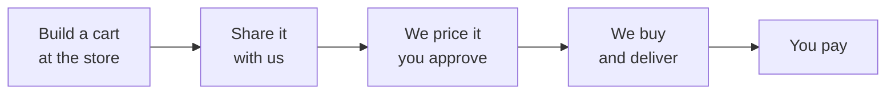

# Customer Guide

Getting materials to your job site without leaving it.

> **Status:** Describes the target system. Not yet implemented — see [00-overview](../architecture/00-overview.md).

---

## How it works

You build a cart on Home Depot's or Lowe's website exactly as you do today. You share it with us instead of buying it. We buy it, and a driver brings it to your site.

**You never pay the store.** You pay us, once, after delivery.



---

## 1. Build your cart

On **homedepot.com** or **lowes.com**:

1. Set your store location — the store you'd actually go to.
2. Add the items you need.
3. Check that everything is available for **immediate pickup** at that store.

> **Do not check out. Do not pay.** The cart is your request to us. You will never be charged by the store.

---

## 2. Share the cart with us

Use the store's **Share Cart** feature and send it to the address we gave you.

Your company has its own address, something like:

```
yourcompany@orders.example.com
```

Use the share option and enter that address as the recipient. Home Depot will send us the cart directly.

> **Use your company's address, not a personal one.** That's how we know the cart is yours. If you send it from somewhere else, it lands in a queue for a dispatcher to sort out and slows everything down.

---

## 3. Review and approve

You'll get an email confirming we received your cart, with a link to your order.

In the portal you will:

1. **Check the items.** Confirm we read your cart correctly — descriptions, quantities, prices.
2. **Enter the delivery address** — where on site the materials should go.
3. **Add drop-off instructions** if they're useful. For example: "Gate code 4412, go to the rear entrance, ask for Dave."
4. **Add an on-site contact** and a phone number if you want text updates.
5. **Review the price** — materials, plus a sizing fee and a delivery fee, itemised.
6. **Approve and pay.**

**Nothing is ordered until you approve the price.** If anything looks wrong, don't approve it — call us and we'll fix it.

---

## 4. Track it

Your order page shows where things stand:

| Status | What's happening |
|---|---|
| Received | We have your cart |
| Awaiting your approval | Waiting on you |
| Confirmed | You approved it |
| Finding a driver | We're lining someone up |
| Driver assigned | Someone is on it |
| At store | Your materials are being bought |
| Purchased | Bought and loaded |
| On the way | Heading to your site |
| Delivered | It's there |
| Payment requested | Your payment link has been sent |
| Paid | Complete |

You'll also get an email when the driver is on the way.

---

## 5. Receive and pay

The driver photographs the delivery, and you'll get an email with that photo, your receipt, and a payment link.

Check that everything arrived, then pay through the link.

> **Check the delivery before you pay.** Count the items. If something is missing or wrong, contact us before paying — it's much easier to fix beforehand.

---

## Things worth knowing

**The cart is a request, not a purchase.** Nothing is reserved at the store. If an item sells out between you sharing the cart and the driver arriving, it may not be available.

**We'll call you if something is out of stock.** Item substitution isn't handled automatically yet — a person will contact you.

**Choose the right store.** We can't tell from your shared cart which store you built it at, so a dispatcher selects it. If you built your cart at the North Frisco location, say so in your delivery instructions — it's a quick way to prevent a wasted trip.

**Timing.** Orders approved by early afternoon are typically delivered the same day.

**One login per company.** Your company has a single portal account.

---

## Frequently asked

**Can I add items after sharing the cart?**
Not to an existing order. Contact us and we'll sort it out — or share a new cart.

**What if I need it today?**
Approve the price as soon as you get the email. Everything after that is automatic.

**Who do I contact?**
Reply to any of our emails, or call the number in your order confirmation.

**Can I cancel?**
Call us. Cancellation isn't self-service yet.

---

## Related

- [Dispatcher guide](dispatcher-guide.md) · [Driver guide](driver-guide.md)
