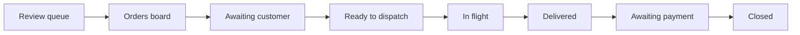

# Dispatcher Guide

Operating the delivery platform, order by order.

> **Status:** Describes the target system. Not yet implemented — see [00-overview](../architecture/00-overview.md).
>
> This replaces the low-tech Google Sheets + Slack runbook in `External Notes/Low Tech Flow.pdf`. That process is retired.

---

## What changed from the old process

| Old process | New process |
|---|---|
| Read the cart email in Gmail | The system parses it; you review the result |
| Copy rows into a Google Sheet | Nothing to copy — the order exists |
| Manually set a "status" cell | Status advances through the app |
| Copy the sheet into a new tab, rename it, share a link | Nothing to copy |
| Post to `#drivers` in Slack and wait | One button broadcasts; the system tracks acceptances |
| Drivers reply in a thread; you transcribe updates | Drivers update their own status and upload their own photos |
| Notice payment arrived, then set "Order Final" | Stripe tells the system; the order advances itself |

The dispatcher role becomes **exception handling and judgement**, not data entry.

---

## Your daily loop



---

## 1. Review the queue

**Where:** `/dispatch/review-queue`

Two things land here:

- **Unparsed carts** — the parser failed, so you correct the items and advance the order.
- **Unattributed emails** — a cart arrived at an address that matches no company. Either attach it to the right company or dismiss it.

An order never silently disappears. If it didn't parse, it is waiting here.

### Resolving a failed parse

1. Open the order. The raw email is rendered beside an editable item table.
2. Compare what was extracted against what the email shows.
3. Correct the items — description, model number, quantity, and line total.
4. Confirm the subtotal reconciles. **The system will not let you advance until the line totals sum to the stated subtotal** — this is the check that catches a misread cart.
5. Advance to `awaiting_customer`.

You do not need to be fast. A cart that fails to parse is a signal the retailer changed their template, and it is worth flagging so the parser can be fixed.

---

## 2. Set the store

**Where:** the order detail page

The cart email does **not** contain the store — this is a limitation of the retailer's email, not a bug. You must select it from the seeded store list.

Pick the store nearest the customer's delivery address. The delivery address is shown next to the store picker so you can sanity-check proximity.

> **This is the highest-consequence manual step in the system.** Nothing in the email lets us verify the customer built their cart for the store you choose. A wrong store means a driver drives to the wrong place and the cart may not be purchasable there.

---

## 3. Price the order

**Where:** the order detail page

Enter the sizing fee and the mileage fee. The total is computed:

```
materials subtotal + sizing fee + mileage fee − discount + tax = total
```

Materials come from the parsed cart and are not editable here. If the cart is wrong, fix it on the items panel.

The fee structure is not yet settled — that is why you enter fees rather than the system calculating them. When the pricing model is decided, this becomes a rules table.

---

## 4. Send the checkout invite

**Where:** order detail → *Send checkout invite*

The customer receives an email with the item list, the full price breakdown, and a link to the portal. They verify the items, enter the delivery address and instructions, accept the price, and pay.

### If the customer never completes checkout

**The system does not expire the order.** Some customers will phone instead.

You can **complete checkout on their behalf**: enter the delivery address and instructions, and accept the price. The system records that a dispatcher did this and who, so the audit trail always answers "who agreed to this price?".

Do not do this without the customer's explicit confirmation on the record.

---

## 5. Dispatch

**Where:** order detail → *Find a driver*

Once the order is `customer_confirmed`, broadcast it. Every active driver is alerted by SMS and sees it in their app. **The first to accept wins** — you do not choose.

Drivers see the store, the item count, and their payout. They do **not** see the customer's address until they accept.

### If nobody accepts

The offers expire and you are notified. Options:

1. **Re-broadcast** — offers the job again to the same pool.
2. **Widen the pool** — if a driver is inactive or unavailable, contact them.
3. **Call a driver directly** and have them accept in the app.

There is no automatic re-broadcast. An order nobody accepts is a signal you should see, not something to retry silently.

### If an assigned driver falls through

Withdraw the assignment, which returns the order to `customer_confirmed`, then broadcast again.

---

## 6. Track and close

The driver advances the order through the delivery statuses and uploads the receipt and delivery photos. You do not transcribe anything.

**Photos are prompted but not required.** If a driver skips one, they must give a reason and you will see it on the order. Do not let skipped receipts become normal — the receipt is the evidence behind the charge.

### Request payment

Once delivered, send the payment request. The system creates a Stripe Payment Link for the exact total and emails it to the customer.

When Stripe confirms payment, the order moves to `paid` on its own, and the customer gets a receipt. You close the order.

---

## Exception handling

| Situation | What to do |
|---|---|
| Cart didn't parse | Review queue → correct items → verify the subtotal reconciles |
| Email arrived at an unknown address | Review queue → attach to the right company or dismiss |
| Customer won't complete checkout | Complete it on their behalf, with their confirmation on record |
| Customer wants to change items | Edit items on the order detail, then re-send the checkout invite. **Any change invalidates an existing payment link** — the system flags this |
| Nobody accepts the job | Re-broadcast, or contact drivers directly |
| Assigned driver can't complete | Withdraw the assignment, re-broadcast |
| Customer disputes the price | Check `order_status_events` and the `confirmed_by` field — the full history is there |
| Payment link expired unpaid | Issue a new one |

---

## What you should never need to do

- Copy data between systems
- Transcribe a driver's status update
- Notice that a payment arrived
- Reconcile the day's orders by hand
- Post to Slack to find a driver

If you find yourself doing any of these, tell the team — it means something is missing.

---

## Related

- [Customer guide](customer-guide.md) · [Driver guide](driver-guide.md) · [Dry-run checklist](dry-run-checklist.md)
- [Order lifecycle](../architecture/04-order-lifecycle.md) — the authoritative state machine
